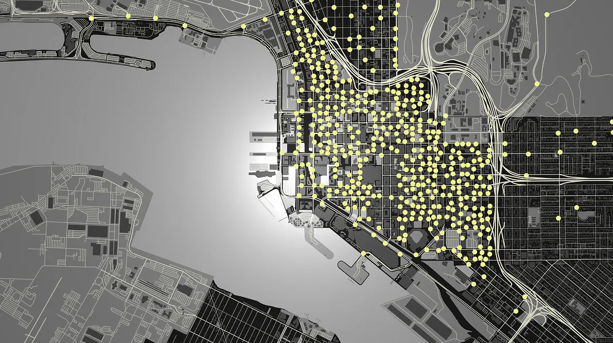
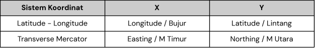
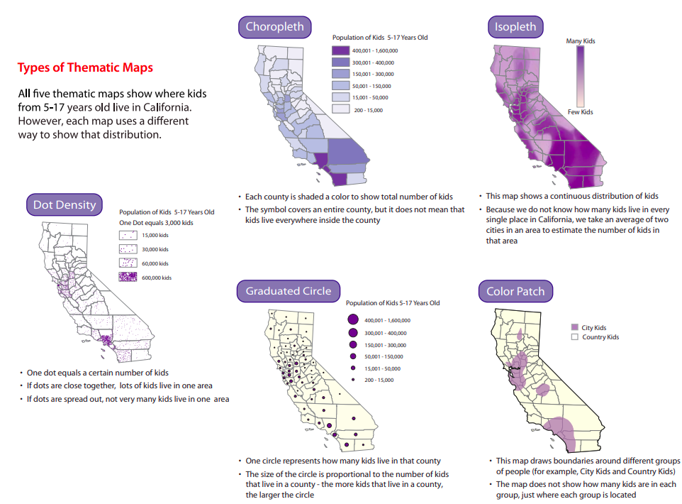

```{r setup, include=FALSE}
# clean up the environment
rm(list = ls())

# setup chunk options
knitr::opts_chunk$set(
  message = FALSE,
  warning = FALSE,
  cache = FALSE,
  fig.align = "center",
  comment = "#>"
)

options(scipen = 9999)
```

Materi ini diproduksi oleh tim dari Algoritma untuk **Memperkenalkan data geospasial untuk keperluan visualisasi tidak hanya 2D melainkan 3D**. Materi berikut hanya ditujukan untuk kalangan terbatas, meliputi individu/personal yang menerima materi ini secara langsung dari lembaga pelatihan. Materi ini *dilarang* untuk direproduksi, didistribusikan, diterjemahkan, atau diadaptasikan dalam bentuk apapun di luar izin dari individu dan organisasi yang berkepentingan.

**Algoritma** adalah pusat pendidikan Data Science di Jakarta. Kami mengadakan workshop dan program pelatihan untuk membantu para profesional dan pelajar untuk mendapatkan keahlian dalam berbagai bidang dalam ruang lingkup Data Science: data visualization, machine learning, data modeling, statistical inference, dan lain-lainnya.

Sebelum masuk ke dalam materi dan menjalankan kode-kode di dalam materi ini, silakan anda melihat bagian **Library/Packages Preparation** untuk melihat dan memastikan semua persyaratan dasar untuk mengikuti materi ini sudah terpenuhi termasuk package-package yang diperlukan. Pada bagian **Tujuan Pembelajaran** anda dapat melihat secara umum apa saja yang akan dipelajari dalam modul materi ini. Kami harap materi ini akan bermanfaat bagi karir ataupun menambah keahlian peserta.

# Preface {.tabset}

## Pendahuluan

Dalam era digital dan informasi yang terus berkembang, data geospasial menjadi sangat penting dalam berbagai bidang seperti pemetaan, pemodelan lingkungan, analisis berbasis lokasi, pengambilan keputusan bisnis, dan pemantauan geografis. Penggunaan data geospasial yang efektif membutuhkan keterampilan analisis dan visualisasi yang kuat, serta pemahaman tentang bahasa pemrograman yang dapat memanipulasi dan memproses data geospasial dengan efisien. Pelatihan Geospasial Visualisasi menggunakan bahasa pemrograman R ini dirancang untuk memperkenalkan peserta dengan alat-alat dan teknik yang diperlukan untuk menganalisis dan memvisualisasikan data geospasial menggunakan bahasa pemrograman R. R merupakan bahasa pemrograman yang populer di kalangan ilmuwan data dan analis statistik, dan telah menjadi salah satu pilihan lain dalam analisis dan visualisasi data geospasial selain menggunakan tools khusus pengolahan data GIS.

Dalam pelatihan ini, peserta akan belajar tentang dasar-dasar pemrograman R, termasuk struktur data, fungsi, dan manipulasi data. Peserta akan diperkenalkan dengan library-library R yang berguna untuk memanipulasi dan memproses data geospasial, seperti `sf`, `terra`, `sp`, `leaflet`, hingga library untuk visualisasi 3D yakni `rayshader`. Peserta akan mempelajari bagaimana mengimpor data geospasial dari berbagai format seperti shapefile, raster, dan data spasial lainnya, serta melakukan manipulasi dan transformasi data geospasial menggunakan R.

Selain itu, peserta akan dilibatkan dalam pembelajaran mengenai visualisasi data geospasial menggunakan grafik, peta, dan animasi dalam bahasa R. Peserta pelatihan akan mendapatkan pemahaman yang solid tentang analisis dan visualisasi data geospasial menggunakan bahasa pemrograman R. Mereka akan dapat mengaplikasikan keterampilan yang diperoleh dalam berbagai proyek yang melibatkan data geospasial, baik itu dalam akademik, penelitian, maupun lingkungan bisnis. Karena, untuk memahami apa yang akan divisualisasikan perlu adanya pemahaman dasar mengenai dasar-dasar geospasial agar tidak terjadi salah representasi.Sehigga, dengan menguasai keterampilan analisis dan visualisasi geospasial menggunakan bahasa pemrograman R, peserta pelatihan akan memiliki keunggulan kompetitif dalam memahami dan memanfaatkan data geospasial untuk pengambilan keputusan yang lebih baik, pemodelan yang lebih akurat, dan pemecahan masalah yang lebih efektif dalam konteks geografis.

Terdapat banyak alat yang tersedia untuk memvisualisasikan informasi geografis; mulai dari aplikasi GIS (Sistem Informasi Geografis) penuh seperti [ArcGIS](https://www.arcgis.com/index.html) dan [QGIS](https://qgis.org/en/site/), hingga alat berbasis web seperti [Google Maps](http://maps.google.com/) hingga berbagai bahasa pemrograman. Dengan beragam paket yang tersedia, penggunaan R untuk analisis geospasial semakin populer. Mulai dari statistik geospasial, pemodelan, dan visualisasi, IDE RStudio juga membuat R menjadi alat yang ramah pengguna untuk pembuatan peta dan analisis.

## Tujuan Pembelajaran

Tujuan utama dari workshop ini adalah untuk memberikan pengenalan yang komprehensif mengenai tools dan perangkat lunak yang digunakan untuk menganalisa dan melakukan visualisasi data geospatial dengan sebuah aplikasi open-source populer: *R*. Selain menggunakan tools khusus GIS yang mana perlu pemahaman dari segi aplikasi yang digunakan serta fungsi dari tools-tools yang digunakan. Adapun materi ini akan mencakup:

**Introductory Module:**

- **Dasar Bahasa Pemrograman R**      
  - Pengenalan bahasa pemrograman R     
  - Bekerja dengan RStudio
  - Fungsi standar pada R
  - Data manipulasi dan persiapan data menggunakan R `dplyr`
  
- **Data Wrangling dan visualisasi dengan R**  
  - Bekerja dengan data tabular di R: Tips dan Teknik
  - Data Wrangling dan Agregasi
  - Pengenalan untuk visualisasi dengan `ggplot2`

**Main Module:**
- **Introduction to Geospatial Data** 
  - Data Spasial:  
    - Data Vektor -> Introduction to Manipulation Data
    - Data Raster -> Introduction to Manipulation Data
    - Representasi sederhana
    
  - Reading and Writing spatial data
    - File Vektor
    - File Raster
  
  - Sistem Koordinat Referensi
    - Coordinate Reference Systems (CRS)
        - Angular coordinates
        - Projections
    - Assigning a CRS
    - Transforming vector data
    - Transforming raster data
    
- **Membuat Peta Interaktif**
  - Pengenalan tentang Peta Interaktif
  - Menggunakan Leaflet
  - Membuat Peta Tematik Interaktif
  
- **Membuat Peta 3D dengan Rayshader**
  - Pengenalan tentang Pustaka Rayshader
  - Memahami Konsep Pemetaan Topografis
  - Membangun Peta 3D dari Data Topografis Spatial.

***

## Library dan Setup

Untuk dapat mengikuti materi ini, peserta diharapkan sudah menginstall beberapa packages di bawah ini. Apabila package tersebut belum terinstall, silahkan jalankan chunk atau baris kode berikut. Apabila sudah ter-install, lewati chunk berikut dan muat package yang dibutuhkan dengan menjalankan chunk selanjutnya.

```{r eval=FALSE}
## DO NOT RUN CHUNK
# packages <- c("readr", "readxl", "stringr","dplyr", "rgdal","sf", "maps", "leaflet", "raster", "osmdata", "ggplot2", "terra")

# install.packages(packages)
```

```{r}
# Data Cleaning
library(readxl) # untuk membaca data excel
library(readr) # untuk membaca data
library(stringr) # untuk persiapan data text
library(dplyr) # untuk data manipulation

# Data Visualization
library(leaflet) # untuk visualisasi interaktif peta
library(ggplot2) # untuk visualisasi plot grafik

# Data Geospatial
library(raster) # untuk read data raster
library(osmdata) # untuk mendapatkan data polygon dari open street map
library(sf) # untuk manipulasi dan analisis data spasial
library(sp) # untuk manipulasi dan analisis data spasial
library(rgdal) # untuk membaca dan menulis data geospatial dalam format yang berbeda (shp)
library(terra) # untuk analisis data spasial dan raster yang lebih kompleks
library(maps) # untuk membuat peta dasar dalam berbagai proyek visualisasi geografis

# Day 3 (Data Visualization)
# library(rayshader) # untuk visualisasi data spatial 3D
```

# Geospatial in R

Materi utama yang akan kita kerjakan yakni mengenai Geospatial Data Visualization. Kita akan mengeksplor bagaimana caranya menggunakan data spatial di R untuk membuat sebuat output yang populer seperti peta baik itu statik maupun interaktif hingga pembuatan peta 3 Dimensi.

Sebelum berangkat lebih jauh dalam membuat visualisasi berupa peta dengan data spasial, kita perlu memahami :
1. Dasar-Dasar GIS (Sistem Informasi Geografis): data geospasial, koordinat, struktur data 
2. Leaflet: memahami apa itu leaflet, kegunaan, hingga cara implementasi
3. Mempersiapkan data Geospatial sebelum digunakan:  memahami format-format

Analisis Geospasial dan pemetaan adalah bidang yang berkembang pesat. Dalam tahap ini, kita akan mempelajari tentang `Leaflet`, sebuah pustaka JavaScript untuk membuat peta interaktif, dan bagaimana menggunakannya di R sebelum kita membuat peta yang lebih bagus menggunakan data asli spatial topografi. [Data Spatial](https://docs.google.com/presentation/d/1SWrkRyi7RW2CrgHrA8ncYAES3yezKBaT9nAquPokA5E/edit#slide=id.g229301573c4_0_23)

```{r echo=FALSE, out.width="90%"}

```


# Data Geospasial
Data geospasial adalah bentuk data yang sangat penting dalam ilmu geografi, ilmu lingkungan, pemetaan, dan banyak bidang lainnya. Data geospasial memungkinkan kita untuk merepresentasikan dan menganalisis dunia nyata dengan cara yang lebih terstruktur. Dalam pemrosesan data geospasial, kita dapat memanfaatkan dua jenis utama data: data vektor dan data raster.

Data geospasial memberikan wawasan yang penting dalam pemahaman dunia kita, dan kemampuan untuk menggabungkan lokasi, atribut, dan informasi temporal membuatnya sangat berharga dalam pemodelan, analisis, dan pengambilan keputusan. 

Library `terra` adalah alat yang kuat untuk bekerja dengan data geospasial, membantu kita menjelajahi dan memahami dunia dengan lebih baik. Library `terra` juga sangat berguna untuk mengolah data raster. Ini memungkinkan kita untuk memanipulasi data raster, menerapkan analisis spasial, dan membuat visualisasi berbasis raster.

## Data Vektor

**Data Vektor**: Data vektor adalah jenis data geospasial yang merepresentasikan objek sebagai titik, garis, atau poligon. Data vektor terdiri dari tiga komponen utama:

   - **Lokasi (Geometri)**: Ini adalah informasi tentang di mana objek atau fitur tersebut berada di permukaan bumi, seperti koordinat geografis (lintang dan bujur).
   
   - **Atribut**: Atribut adalah informasi tentang karakteristik objek tersebut, misalnya nama, jenis, ukuran, dan sebagainya.
   
   - **Temporal**: Beberapa data vektor juga dapat mencakup informasi waktu, seperti kapan objek tersebut dibuat atau berubah.

### Representasi titik

Geometri titik terdiri dari satu titik sudut (X, Y dan opsional Z). 
```{r}
# Run Code Below:
# Koordinat titik stasiun
lon <- c(-116.8, -114.2, -112.9, -111.9, -114.2, -115.4, -117.7)
lat <- c(41.3, 42.9, 42.4, 39.8, 37.6, 38.3, 37.6)

# Data stasiun dalam bentuk matriks
stasiun_crh <- cbind(lon, lat)
stasiun_crh
```

> Kesalahan umum: Jangan sampai salah penempatan antara `longitude` (bujur) dan `latitude` (lintang). Karena, penempatan yang salah ini dapat mengakibatkan interpretasi yang salah terhadap data geografis Anda.

Pada umumnya, dalam representasi geografis, `latitude` (lintang) digunakan untuk mengukur posisi relatif utara-selatan di bola bumi, sementara `longitude` (bujur) digunakan untuk mengukur posisi relatif timur-barat. Dalam sebagian besar peta, sumbu vertikal atau garis meridian (garis vertikal yang menghubungkan Kutub Utara dan Kutub Selatan) biasanya digunakan untuk menggambarkan `latitude`, sementara sumbu horizontal atau garis ekuator (garis horizontal yang mengelilingi bola bumi secara horizontal) digunakan untuk menggambarkan `longitude`.

Kita bisa menggunakan fungsi `plot()` untuk menampilkan tampilan data vektor tersebut secara langsung.
```{r}
## Your Code Here
plot(stasiun_crh)
```

```{r}
# Tampilan alas peta agar lebih rapih
plot(stasiun_crh,
     main = "Peta Stasiun Curah Hujan", 
     xlab = "Longitude",
     ylab = "Latitude")
```

```{r}
# Plot alas peta
plot(stasiun_crh,
     main = "Peta Stasiun Curah Hujan", 
     xlab = "Longitude",
     ylab = "Latitude")

# Menambahkan titik pada koordinat stasiun
points(stasiun_crh,
       cex = 1, # kode bentuk poin
       pch = 18,
       col = "black")
```

### Representasi Polyline/Garis

Untuk menampilkan garis, secara mudah kita hanya perlu titik-titik koordinat. Geometri poliline terdiri dari dua atau lebih simpul yang membentuk garis saling terhubung. 
```{r}
# Plot peta
plot(stasiun_crh,
     main = 'Peta Stasiun Curah Hujan',
     xlab = 'Longitude',
     ylab = 'Latitude')

# Menambahkan polyline dengan warna yang lebih menarik dan lebih tebal
lines(stasiun_crh, 
      col = "orange", 
      lwd = 3 )
```

### Representasi Poligon

Geometri poligon terdiri dari setidaknya empat simpul yang membentuk suatu area tertutup. Simpul pertama dan terakhir selalu berada pada tempat yang sama. 
```{r}
# Plot peta
plot(stasiun_crh,
     main = 'Peta Stasiun Curah Hujan',
     xlab = 'Longitude',
     ylab = 'Latitude')

# Menambahkan polygon sebagai latar belakang dengan warna yang lebih menarik
polygon(stasiun_crh,
        col = '#FFA07A',
        border = '#FF6347')
```

### Tampilan Data Vektor (Gabungan)

```{r}
# Plot peta Secara keseluruhan data vektor: titik, garis, area/poligon
plot(stasiun_crh,
     main = 'Peta Stasiun Curah Hujan',
     xlab = 'Longitude',
     ylab = 'Latitude')

# Menambahkan polygon sebagai latar belakang dengan warna yang lebih menarik
polygon(stasiun_crh, col ='#FFA07A', border ='#FF6347')

# Menambahkan polyline dengan warna yang lebih menarik dan lebih tebal
lines(stasiun_crh, col = 'darkred', lwd = 3)

# Menambahkan titik pada koordinat stasiun dengan warna oranye tua
points(stasiun_crh, cex = 2, pch = 20, col = 'black')

# Menambahkan label pada titik stasiun dengan warna biru
text(stasiun_crh, labels = 1:7, pos = 3, offset = 0.5, col = 'blue', cex = 0.8)

```

> Note: urutan data yang ditampilkan pada plot menggunakan `library terra` diatas tidak seperti layering ggplot. Namun, data yang mau ditampilkan paling atas justru ditaruh pada kode paling akhir. 

Dalam kode di atas, kita menggunakan fungsi `text()` sebagai tambahan untuk menambahkan label nama kota ke dalam plot. Fungsi `text()` memerlukan tiga argumen utama:

1. `x`: Objek vektor geospasial yang akan digunakan sebagai referensi untuk menempatkan teks (dalam hal ini, `stasiun_crh`).

2. `labels`: Vektor yang berisi label atau nama yang ingin Anda tambahkan ke plot (dalam hal ini, `1 sampai 7`).

3. `pos`: Posisi teks relatif terhadap titik referensi. Di sini, `pos = 3` berarti teks akan ditempatkan di atas titik referensi.

4. Dengan menggunakan fungsi `text()`, kita dapat menambahkan label nama kota ke plot objek vektor geospasial kita.

```{r}
# Menampilkan sistem referensi koordinat menggunakan crs()
crs(stasiun_crh)
```

```{r}
# Data stasiun dalam bentuk matriks (titik koordinat dari yang sebelumnya)
class(stasiun_crh)
```


**Data Vector:** Dilengkapi dengan representasi geometris titik, garis, poligon, dan multi-polihibrid. Berikut ini merupakan representasi sederhana dari data spasial  berbentuk vektor.

Bagaimana cara merepresentasikan data diatas jika menambahkan atribut lain.
```{r}
## Run code below
# Data stasiun dalam bentuk matriks (titik koordinat dari yang sebelumnya)
stasiun_crh

# Nama stasiun dari 1:7
nama <- LETTERS[1:7]

# Simulasi data curah hujan (dummy data sebagai atribut)
precip <- c(200, 100, 320, 978, 153, 903, 303)
# Kolom precip (curah hujan)
crh <- cbind(stasiun_crh, nama, precip)
crh
```
Jadi, secara keseluruhan, kode tersebut menghasilkan vektor `precip` yang berisi data curah hujan simulasi dengan angka-angka acak yang telah diolah agar memiliki sifat yang mirip dengan data curah hujan (dummy data).

Peta lokasi titik-titik tidak berbeda jauh dari plot dasar pada umumnya (x,y). Namun, pada kasus ini titik-titik tersebut sebanding dengan nilai jumlah curah hujan yang dimiliki (pada data `precip`).

```{r}
## Run Code Below:
# Ukuran titik berdasarkan curah hujan (lebih besar curah hujan, lebih besar titiknya)
psize <- 1 + precip/100

# Plot peta dengan warna yang lebih menarik
plot(crh,
     cex = psize, # ukuran
     col = "darkblue" , # warna titik (jika tidak pakai pch maka hanya border saja)
     pch = 20, # Jenis titik
     main = 'Peta Lokasi Curah Hujan berdasarkan Jumlah Curah Hujannya') # Judul

# Menambahkan nama stasiun pada plot
text(stasiun_crh, nama, pos = 3, col = 'orange')

# Membuat legenda
breaks <- c(100, 250, 500, 1000)
legend.psize <- 1 + breaks / 500

legend(
  "topright",
  legend = breaks,
  pch = 20,
  pt.cex = legend.psize,
  col = 'darkblue',
  bg = 'white'
)
```

**Note:**

Tidak ada kode khusus yang harus Anda gunakan untuk menentukan `psize` (ukuran titik) berdasarkan nilai precip (curah hujan). 

Cara Anda menghitung `psize` dalam kode yang Anda bagikan, yaitu `psize <- 1 + precip/200`, adalah cara yang umum digunakan untuk menyesuaikan ukuran titik berdasarkan data numerik. 

Di dalam rumus tersebut:
- `1` adalah ukuran dasar titik.

- `precip` adalah nilai curah hujan.

- `200` adalah faktor yang mengontrol seberapa besar perbedaan ukuran titik berdasarkan nilai curah hujan. Semakin besar faktor ini, semakin besar perbedaan ukuran titik.

Kita dapat mengubah rumus ini sesuai dengan preferensi. Misalnya, jika ingin membuat perbedaan ukuran yang lebih besar, kita dapat meningkatkan faktor pembagi (misalnya, `1000`), dan sebaliknya.

Contoh lain:

- `psize <- 1 + precip/1000` akan menghasilkan titik yang lebih kecil untuk curah hujan yang lebih tinggi.

- `psize <- 1 + sqrt(precip)/10` akan menghasilkan titik yang lebih besar untuk curah hujan yang lebih tinggi dengan menggunakan akar kuadrat.

Anda dapat menyesuaikan rumus diatas sesuai dengan preferensi untuk menentukan ukuran titik berdasarkan data curah hujan.


## Data Raster

**Data Raster**: Data raster adalah sel berpiksel atau berkisi yang direpresentasikan sebagai baris dan kolom. Ini adalah data berpiksel (atau berkisi) yang setiap pikselnya dikaitkan dengan lokasi geografis tertentu. Raster geospasial hanya berbeda dengan foto digital karena disertai dengan informasi spasial yang menghubungkan data ke lokasi tertentu. Raster adalah foto udara digital, citra dari satelit, gambar digital.

[Ini adalah situs web untuk memahami dengan contoh bagaimana data raster adalah data geospasial](https://learn.microsoft.com/en-us/bingmaps/articles/bing-maps-tile-system)

Kumpulan data raster berpotensi sangat besar. Resolusi meningkat seiring dengan mengecilnya ukuran sel; namun, biasanya biaya juga meningkat baik pada ruang disk maupun kecepatan pemrosesan.

Data raster adalah salah satu jenis data geospasial yang sangat penting. Ini adalah representasi dari permukaan yang dibagi menjadi sel berpiksel atau berkisi, dengan setiap piksel memiliki nilai yang mewakili atribut atau fenomena di lokasi geografis tertentu. Berikut ini penjelasan tentang contoh kode dan materi yang Anda bagikan:

1. **Membuat Data Raster**:
   - Pada contoh kode berikut, kita menggunakan fungsi `rast` dari library `terra` untuk membuat objek data raster.
   - `ncol` dan `nrow` adalah argumen yang menentukan jumlah kolom dan baris pada data raster.
   - `xmin`, `xmax`, `ymin`, dan `ymax` digunakan untuk menentukan batas-batas geografis data raster.

```{r}
# Run code below:
r <- rast(ncol = 5,
          nrow = 5,
          xmin = -150,
          xmax = -80,
          ymin = 20,
          ymax = 60)
r
```

> rast() -> untuk mengubah nilai-nilai piksel diatas menjadi sebuah nilai piksel untuk membentuk data raster

2. **Memberikan Nilai Piksel**:
   - Setelah membuat objek data raster, kita menggunakan fungsi `values` untuk memberikan nilai pada piksel-piksel di dalamnya.
   - Pada contoh pertama, kita mengisi nilai piksel dengan bilangan acak antara 0 dan 1 menggunakan `runif`.
   - Pada contoh kedua, kita mengisi nilai piksel dengan urutan nilai dari 1 hingga jumlah sel (ncell) dalam data raster.

```{r}
# Memberikan nilai pada piksel value
set.seed(99)
values(r) <- runif(ncell(r))
values(r) <- 1:ncell(r)
```

3. **Visualisasi Data Raster**:
   - Terakhir, gunakan fungsi `plot` untuk memvisualisasikan data raster.
   - Kita juga bisa menentukan palet warna yang sesuai dengan menggunakan argumen `col`. Dalam contoh ini, kita akan menggunakan palet warna `terrain.colors(25)`.
```{r}
# Visualisasi data raster dengan palet warna yang sesuai
plot(r, col = terrain.colors(25))
```
Hasil dari kode ini adalah data raster yang berisi piksel-piksel dengan nilai-nilai yang telah kita tentukan, dan visualisasi yang menunjukkan representasi grafis dari data tersebut dengan palet warna yang sesuai.

Data raster sangat berguna dalam berbagai aplikasi, seperti pemetaan cuaca, penginderaan jauh, pemodelan lingkungan, dan banyak lagi. Mereka memungkinkan kita untuk menganalisis fenomena yang berubah-ubah di seluruh permukaan bumi dengan tingkat detail yang beragam, tergantung pada resolusi raster.


# Coordinate Reference Systems (CRS)

Sistem Referensi Koordinat (CRS)  yang mendefinisikan bagaimana elemen spasial data berhubungan dengan permukaan bumi (atau benda lain). Ini seperti kita memadatkan permukaan bumi yang bulat menjadi peta yang datar.

Pentingnya CRS dalam data geospasial adalah agar kita bisa:

  1. **Mengukur dengan Tepat:** Jika kita ingin mengukur jarak atau luas di peta, kita harus tahu bagaimana skala pengukuran ini diubah dari bentuk asli bumi yang bulat.
  
  2. **Pemetaan:** CRS membantu kita menggambarkan peta dengan benar, karena setiap peta mungkin memiliki caranya sendiri untuk merubah permukaan bumi.
  
  3. **Integrasi Data:** Ketika kita menggabungkan data dari berbagai sumber, semua data ini harus menggunakan CRS yang sama agar bisa digunakan bersama.
  
  4. **Georeferensi:** Ini berarti mengaitkan koordinat dunia nyata dengan lokasi di peta, yang hanya bisa dilakukan jika kita tahu CRS yang digunakan.

`Komponen Penting`: Sebuah CRS umumnya terdiri dari beberapa komponen penting:
  1. **Metode Proyeksi**: Ini menentukan metode matematika yang digunakan untuk mengubah permukaan Bumi menjadi datar. Proyeksi umum meliputi Mercator, Lambert Conformal Conic, dan Albers Equal Area.
  
  2. **Datum**: Sebuah datum menentukan titik referensi dan orientasi sistem koordinat. Datum yang berbeda digunakan untuk berbagai bagian dunia.
  
  3. **Satuan**: Ini menentukan satuan pengukuran yang digunakan untuk jarak, seperti meter, kaki, derajat, atau satuan lainnya.
  
  4. **Titik Asal**: Beberapa proyeksi memiliki titik tertentu di permukaan Bumi sebagai titik asal mereka.
  
  5. **Garis Bujur Pusat**: Ini sering digunakan dalam proyeksi untuk menentukan garis bujur pusat peta.

Semua komponen ini bekerja bersama-sama untuk menggambarkan lokasi dan bentuk objek di dunia nyata ke dalam sistem koordinat yang bisa digunakan dalam analisis dan pembuatan peta.

Jadi, kesimpulannya, CRS adalah cara kita membuat peta yang akurat dan melakukan berbagai analisis berdasarkan lokasi. Yang penting, kita harus memilih CRS yang sesuai untuk setiap proyek berdasarkan kebutuhan dan daerah yang akan dipetakan.

[Ilustrasi Proyeksi Peta](https://docs.google.com/presentation/d/1SWrkRyi7RW2CrgHrA8ncYAES3yezKBaT9nAquPokA5E/edit#slide=id.g252ac0f00aa_0_12)

```{r koord, echo = FALSE, out.width="80%",fig.align = "center"}

```

Dalam peta, biasanya kita menggunakan sistem koordinat geografis yang terdiri dari garis `bujur (longitude)` dan garis `lintang (latitude)` untuk menunjukkan lokasi suatu tempat di permukaan bumi. Namun, dalam konteks sistem koordinat X-Y, kita menggantinya dengan sumbu X dan Y untuk menyatakan lokasi.

1. *Garis Bujur (Longitude)*:
   - Garis bujur adalah garis imajiner yang berjalan dari Kutub Utara ke Kutub Selatan melalui pusat Bumi.
   - Dalam sistem koordinat X-Y, garis bujur biasanya diwakili oleh sumbu X. Sumbu X akan menggambarkan posisi secara horizontal dari barat ke timur.
   - Nilai-nilai positif di sumbu X akan mewakili garis bujur di sebelah timur garis meridian nol (0°), yang biasanya berada di Greenwich, London. Nilai-nilai negatif akan mewakili garis bujur di sebelah barat garis meridian nol.

2. *Garis Lintang (Latitude)*:
   - Garis lintang adalah garis imajiner yang berjalan sejajar dengan garis ekuator dan berpotongan tegak lurus dengan garis bujur.
   - Dalam sistem koordinat X-Y, garis lintang biasanya diwakili oleh sumbu Y. Sumbu Y akan menggambarkan posisi secara vertikal dari selatan ke utara.
   - Nilai-nilai positif di sumbu Y akan mewakili garis lintang di utara garis ekuator (0°). Nilai-nilai negatif akan mewakili garis lintang di selatan garis ekuator.

Contoh:
- Jika Anda memiliki koordinat X = 45 dan Y = -30, itu akan menunjukkan suatu lokasi di sebelah timur garis bujur 45° dan di selatan garis lintang 30°.
- Jika Anda memiliki koordinat X = -75 dan Y = 10, itu akan menunjukkan suatu lokasi di sebelah barat garis bujur 75° dan di utara garis lintang 10°.

Penting untuk dicatat bahwa sistem koordinat X-Y ini hanya digunakan dalam konteks peta yang sudah diberikan dengan proyeksi tertentu, dan penggunaannya lebih umum dalam pemetaan dan ilmu geospasial. Dalam pemetaan dunia nyata, koordinat geografis (garis bujur dan garis lintang) masih lebih umum digunakan.


## Sistem koordinat geografis
Sistem koordinat geografis mengidentifikasi lokasi mana pun di permukaan bumi menggunakan dua nilai — garis bujur dan garis lintang.
Bujur adalah letaknya yang berarah Timur-Barat pada jarak sudut dari bidang Meridian Utama. Lintang adalah jarak sudut Utara atau Selatan bidang ekuator. Oleh karena itu, jarak dalam CRS geografis tidak diukur dalam meter. 

Permukaan bumi dalam sistem koordinat geografis diwakili oleh permukaan bola atau ellipsoidal. Ellipsoid adalah bagian dari komponen CRS yang lebih luas: datum . Ini berisi informasi tentang ellipsoid apa yang digunakan dan hubungan yang tepat antara koordinat Cartesian dan lokasi di permukaan bumi. Ada dua jenis datum — geosentris (misalnya WGS84) dan lokal (misalnya NAD83).

```{r crs, echo = FALSE, out.width="80%",fig.align = "center", fig.cap="Source:[DataCarpentry](https://datacarpentry.org/)"}
knitr::include_graphics("img/crs.jpg")
```

## Proyeksi sistem referensi koordinat
Sistem proyeksi adalah cara yang lebih praktis untuk melakukan perhitungan dan sangat penting untuk membuat peta. Sistem referensi ini disebut "proyeksi" karena mengubah koordinat sudut 3D menjadi sistem datar (planar). Beberapa contoh proyeksi yang umum digunakan adalah UTM, Mercator, dan lainnya.

Ada tiga kelompok utama jenis proyeksi - berbentuk kerucut, silindris, dan planar (azimut). Dalam proyeksi kerucut, permukaan bumi diproyeksikan ke dalam kerucut sepanjang satu garis singgung atau dua garis singgung. 

### Contoh Implementasi Definisi Koordinat

Data titik koordinat curah hujan x dan y diatas tadi masih belum memiliki koordinat referensi karena masih dalam format matrix, sehingga perlu kita define masih menggunakna library `terra`. Dalam kasus ini, Kita telah menggunakan proyeksi `+proj=longlat +datum=WGS84` untuk mendefinisikan koordinat referensi sebagai koordinat geografis WGS84, yang sangat umum digunakan.

Ini adalah langkah-langkah yang diperlukan untuk memberikan koordinat referensi ke objek data vektor geospasial di paket `terra`. Dengan koordinat referensi yang sudah ditentukan, Kita dapat melakukan analisis geospasial yang lebih akurat dan visualisasi yang tepat pada peta.
```{r}
# Definisi koordinat referensi
coor_ref <- "+proj=longlat +datum=WGS84"

#  Buat objek data vektor
titik_crh <- vect(stasiun_crh, crs = coor_ref)

# Menampilkan objek vektor dengan atribut curah hujan
crs(titik_crh)
class(stasiun_crh)
class(titik_crh)
```

```{r}
plot(stasiun_crh)
plot(titik_crh)
```


Berikut adalah penjelasan singkat tentang langkah-langkah diatas:

1. Mendefinisikan koordinat referensi dengan menggunakan string `"+proj=longlat +datum=WGS84"`, yang mendefinisikan proyeksi geografis dan datum sebagai WGS84.

2. Membuat objek data vektor geospasial `titik_crh` dari koordinat `stasiun_crh` dengan menentukan `crs` (koordinat referensi) yang telah Anda definisikan sebelumnya yakni coor_ref.

3. Kemudian, memeriksa objek data vektor geospasial `titik_crh` untuk memastikan bahwa koordinat referensinya telah ditambahkan dengan benar.

***

# Mambaca data spasial

## Jenis-Jenis Data Geospasial
- Terdapat berbagai jenis data geospasial yang digunakan untuk merepresentasikan informasi geografis. Beberapa jenis data geospasial yang umum meliputi:
  - `Shapefile`: Format file vektor yang sangat umum digunakan dalam pemetaan dan sistem informasi geografis (SIG).
  - `GeoJSON`: Format file vektor berbasis JSON yang populer untuk pertukaran data geospasial.
  - `Raster`: Representasi data dalam bentuk kisi piksel, seperti citra satelit atau peta tematik.
  - `KML`: Format file yang digunakan untuk pertukaran data geospasial dan digunakan dalam Google Earth.
  - `TopoJSON`: Format file yang mengurangi ukuran data geospasial untuk pengiriman dan pengolahan yang lebih efisien.


## Membaca `shapefile`

Ada banyak format data yang dapat digunakan untuk menyimpan data spasial. *KML*, *GeoJSON*, *GeoTIFF*, *Tab File*, adalah beberapa format umum yang mungkin pernah Anda temui. Namun, format yang paling umum digunakan dalam pemetaan sistem informasi geografis adalah **Shapefile**.

**Shapefile** adalah standar universal format geospasial yang dikembangkan dan diatur oleh [Esri](https://www.esri.com/en-us/home), penyedia perangkat lunak sistem informasi geografis internasional. Format ini kemudian diadopsi oleh banyak bahasa pemrograman, termasuk R.

Nama Shapefile mungkin sedikit menyesatkan karena file ini umumnya terdiri dari beberapa file terpisah:

- `.shp` (**wajib**): berisi data geometri.
- `.shx` (**wajib**): berisi data indeks yang digunakan untuk mengidentifikasi geometri yang berbeda.
- `.dbf` (**wajib**): berisi informasi atribut (tabel dengan info lebih lanjut tentang setiap fitur). 
- `.prj` berisi informasi tentang sistem koordinat referensi.

Selain file yang tercantum di atas, sebuah shapefile dapat mencakup komponen file lainnya. Daftar komponen shapefile yang komprehensif dapat diakses [di sini](https://www.loc.gov/preservation/digital/formats/fdd/fdd000280.shtml).

### Membaca `shapefile` (inageoportal)
Untuk kasus ini, saya telah menyediakan shapefile untuk mengakses dan mendownload data SHAPEFILE (shp) dari portal Tanah Air Indonesia. Langkah unduh bisa dilihat pada: [Slide Share](https://docs.google.com/presentation/d/1SWrkRyi7RW2CrgHrA8ncYAES3yezKBaT9nAquPokA5E/edit#slide=id.g24226a96176_0_0)

Mari baca file menggunakan fungsi `st_read()` dari paket `sf`:
```{r}
# Read data:
adm_bantul <- st_read("dataset/Kec_Bantul/kec_bantul.shp")
```

Ada beberapa informasi yang disimpan dalam geometri `sf`:

- **Geometry Type/Jenis Geometri**: Ada tujuh jenis geometri paling umum dalam fitur sederhana: `POINT`, `LINESTRING`, `POLYGON`, `MULTIPOINT`, `MULTILINESTRING`, `MULTIPOLYGON` dan `GEOMETRYCOLLECTION`.
- **Dimension/Dimensi**: Mengacu pada ruang 2-(`XY`), 3-(`XYZ`/`XYM`) atau 4 dimensi (`XYZM`).
- **Bbox (Bounding Box)**: area yang ditentukan oleh dua garis bujur dan dua garis lintang.
- **CRS**: Sistem Referensi Koordinat.

`sf` merupakan singkatan dari "Simple Features" yang merepresentasikan data sebagai catatan dalam sebuah data.frame atau tibble dengan sebuah kolom list geometri[^3]. **Simple Features** adalah model data hierarkis yang mewakili berbagai jenis geometri. Dari 17 jenis geometri yang didukung oleh spesifikasi, hanya 7 yang digunakan dalam sebagian besar penelitian geografis:

```{r geom, echo = FALSE, out.width="80%",fig.align = "center", fig.cap="Source:[Geocomputation with R](https://geocompr.robinlovelace.net/)"}
knitr::include_graphics("img/geom.png")
```

Jika kita menggunakan fungsi `class()` untuk objek `adm_bantul` yang baru dibuat, kita dapat melihat bagaimana kelas `sf` mengelola data spasial dengan cara yang mirip dengan struktur data tabel biasa; dengan menyimpannya sebagai data frame:

```{r}
## Your code here
class(adm_bantul)
```

Perbedaan utama antara sebuah data frame biasa dengan sebuah objek `sf` adalah bahwa objek `sf` memiliki kolom `geometry` yang menjelaskan di mana fitur tersebut terletak di Bumi, dan mereka memiliki atribut, yang menjelaskan properti lainnya:
```{r}
## Your code here
adm_bantul
```

**POLYGON**:

  - *Tipe geoometri*: Ini adalah atribut yang berkaitan dengan data vektor berupa poligon (POLYGON).
  - *Dimension* Geometri jenis POLYGON dengan dimensi XY (2D).
  - *Bbox* (Bounding box / kotak pembatas) menunjukkan kotak yang mencakup seluruh poligon dalam data tersebut dalam koordinat geografis.
  - *CRS* adalah "WGS 84" yang juga mengindikasikan sistem referensi koordinat geografis WGS 84.

Untuk mendapatkan gambaran yang lebih baik tentang informasi `geometry` dalam objek `sf`, mari kita lanjutkan dan plot `adm_bantul$geometry` menggunakan fungsi `plot()`:
```{r}
## Your code here
plot(adm_bantul$geometry)
```

***

### Membaca `shapefile` (`GADMTools`)

Data spasial vector untuk Indonesia selain bisa didapatkan melalui inageoportal, kita bisa menggunakan library GADMTools dimana GADM sudah menyediakan data spasial vektor dalam 4 level ketelitian, namun pada course ini kita akan coba lihat dalam 3 level:

- Provinsi
- Kabupaten/Kota
- Kecamatan

**Tip Ekstra**:  
Anda juga dapat mengakses basis data GADM langsung dari R dengan bantuan pustaka [`GADMTools`](https://github.com/Epiconcept-Paris/GADMTools):
```{r}
# Install requirement packages for packages GADMTools
# install.packages(c('maptools', 'rosm', 'rgeos', 'ggmap', 'ggspatial', 'prettymapr'))

# Install Packages GADMTools
# install.packages("https://cran.r-project.org/src/contrib/Archive/GADMTools/GADMTools_3.9-1.tar.gz", repos = NULL, type = "source")
```

Pada bagian code dibawah ini, tidak perlu menjalankan read object `map` dikarenakan isi darinya sudah kami unduh dan sedikit filter berdasarkan level 2 saja pada folder `shp`.
```{r}
# Code example to load Indonesia's spatial vector in Kabupaten/Kota level  
library(GADMTools)  

# map <- gadm_sf_loadCountries(c("IDN"), level=2, basefile = "./")
```

***

Mari baca file menggunakan fungsi `st_read()` dari paket `sf`:

```{r}
idn <- st_read(dsn = "shp", layer = "idn")
```

Cek tipe data/kelas object:
```{r}
class(idn)
```

Cek atribut:
```{r}
glimpse(idn)
```

Untuk mendapatkan pemahaman yang lebih baik tentang informasi geometri dalam objek `sf`, mari lanjutkan dan gambarkan `idn$geometry` menggunakan fungsi `plot()`:

```{r}
plot(idn$geometry)
```

Keuntungan besar penggunaan `sf` adalah bagaimana setiap fungsi dapat digabungkan menggunakan operator `%>%` dan berfungsi dengan baik dengan koleksi paket R dari tidyverse, yang memberikan kami kendali yang lebih baik atas informasi geometri dalam objek `sf`. Misalnya, untuk mengambil subset provinsi tertentu, Anda dapat menggunakan metode `filter()` seperti yang Anda lakukan dengan data frame biasa:

```{r}
unique(idn$NAME_1)
```

Melakukan agregrasi data untuk melakukan filtering langsung dari data idn untuk mendapatkan shp dengan area sesuai dengan kebutuhan, mari kita coba untuk mengambil provinsi Bali:
```{r}
# Code here
bali_prov <- idn %>% 
  filter(NAME_1 == "Bali")

plot(bali_prov$geometry)
```


```{r}
bali_kab <- idn %>% 
  filter(NAME_1 == "Bali") %>% 
  group_by(NAME_2) %>% 
  summarise()

plot(bali_kab$geometry)
```

**Dive deeper:**

Silahkan untuk coba melakukan pengambilan shp pada daerah Kabupaten Bantul menggunakan library GADM.

```{r}
# Type Your Code here
bantul_adm <- idn %>% 
  filter(NAME_2 == "Bantul") %>% 
  group_by(NAME_3) %>% 
  summarise()

plot(bantul_adm$geometry)

```

# Studi Kasus: Peta Tematik Kepadatan Penduduk

**🗺️ Pembuatan Peta Tematik**

Secara umum, data spasial dapat direpresentasikan sebagai **peta referensi** atau **peta tematik**. Sementara peta referensi menekankan lokasi objek di dunia, peta tematik menunjukkan variabilitas spasial dari distribusi tertentu. Peta distribusi harga rumah yang telah kita buat sebelumnya adalah salah satu jenis peta tematik yang paling sering digunakan dalam data geospasial, yang disebut **peta Choropleth**.

```{r thematic-map, echo = FALSE, out.width = '100%',fig.align = "center", fig.cap="Source: [Mapping Ideas from Cyberspace to Realspace](http://mappingideas.sdsu.edu/CaliforniaAtlas/atlas/pages/10_types_of_maps.pdf)"}

```

Menggunakan data shp Kecamatan Bantul
```{r}
# cek keseluruhan data shp
plot(adm_bantul)
```

```{r}
glimpse(adm_bantul)
adm_bantul$kecamatan
```


```{r}
# hanya plot polygon adm nya saja berdasarkan kolom geometry
plot(adm_bantul$geometry)
crs(adm_bantul)
```

Melakukan penyesuaian koordinat pada object `adm_bantul`-> menggunakan st_transform()
```{r}
# Code here
adm_bantul <- st_transform(x = adm_bantul, crs = "EPSG:4326")
```

Read data kepadatan penduduk Kabupaten Bantul per Kecamatan dalam bentuk .xls menggunakan `read_excel()`:
```{r}
library(readxl)

kpdt_pddk <- read_excel("dataset/Kec_Bantul/kpdt.xls")
kpdt_pddk
```

```{r}
# Join csv dengan shp
kpdt_bantul <- adm_bantul %>%
  left_join(kpdt_pddk, by = c("kecamatan" = "kecamatan")) %>% 
  arrange(kecamatan)

glimpse(kpdt_bantul)
```

```{r}
plot(kpdt_bantul)
```


___
END OF DAY 2
___


## Membuat Peta di R

### Membuat Peta dengan Library `ggplot2`

```{r}
# Code here


```

### Membuat Peta dengan Library `leaflet`

```{r message=FALSE}
# Leaflet
library(leaflet)
library(BAMMtools) # untuk menghitung pembingkaian data (jenks breaks)
```

*Persiapan visualisasi:*
```{r message=FALSE}
# Mendefinisikan Label Pop-up:
labels <- sprintf("<strong>%s</strong><br/>%g penduduk / km<sup>2</sup>",
  kpdt_bantul$kecamatan, kpdt_bantul$kpdt_pddk) %>% lapply(FUN = htmltools::HTML)

# Mendefinisikan Warna:
col <- kpdt_bantul$kpdt_pddk

# kategorisasi variabel kepadatan penduduk kedalam 5 kelompok
bins <- c(getJenksBreaks(kpdt_bantul$kpdt_pddk, k = 5))

# melakukan pewarnaan
pal <- colorBin("YlOrRd", 
                domain = col, # variabel yang ingin dipetakan
                bins = bins )
```

*Code Complete:*
```{r message=FALSE}
# Plot Peta:
Bantul <- leaflet(kpdt_bantul) %>%
  # Base groups
  addTiles(group = "OSM (default)") %>%
  addProviderTiles(providers$Stamen.Toner, group = "Toner") %>%
  addProviderTiles(providers$Stamen.TonerLite, group = "Toner Lite") %>%
  addProviderTiles(provider = "OpenTopoMap") %>% 
  
  # Layer Polygon
  addPolygons(fillColor = pal(col), # memberi warna pada poligon sesuai dengan nilai kpdt_pddk
              weight = 2,
              opacity = 1,
              color = "white",
              dashArray = "3",
              fillOpacity = 0.7, 
              highlightOptions = highlightOptions(weight = 5,
                                                  color = "#666",
                                                  dashArray = "",
                                                  fillOpacity = 0.7,
                                                  bringToFront = TRUE),
              label = labels,
              labelOptions = labelOptions(
                style = list("font-weight" = "normal", padding = "3px 8px"),textsize = "15px")) %>% 
  # Legenda peta
  addLegend("bottomright", 
            pal = pal,
            values = ~col,
            title = "Kepadatan Penduduk Kabupaten Bantul",
            labFormat = labelFormat(digits = 2),
            opacity = 1) %>% 
  # Layers control
  addLayersControl(
    baseGroups = c("OSM (default)", "Toner", "Toner Lite", "Open Topo Map"),
    options = layersControlOptions(collapsed = TRUE)
  )
Bantul
```

Secara umum, data spasial dapat direpresentasikan baik sebagai **peta referensi** maupun **peta tematik**. Sementara peta referensi menekankan lokasi objek di dunia, peta tematik menunjukkan variasi spasial dari distribusi tertentu. Peta kepadatan penduduk yang telah kita buat merupakan salah satu jenis peta tematik yang paling sering digunakan dalam dunia geospasial.

Selain fitur sederhana `sf`, sebenarnya ada metodologi lain untuk menyimpan model fitur geografis ke dalam R. Jika Anda pernah melakukan penelitian geospasial di R, Anda mungkin juga familiar dengan penggunaan paket `sp`. Sebenarnya, `sp` adalah paket yang sangat baik dikembangkan sejak tahun 2005 yang praktis mendukung hampir setiap analisis GIS di R, bahkan sampai sekarang.

Masalah utama dari `sp` adalah kompatibilitasnya yang rendah dengan struktur data frame R. `sf` dibangun untuk mengisi kesenjangan tersebut. Dirilis pada tahun 2016, `sf` menggunakan standar OGC (Open Geospatial Consortium) & ISO dalam mencatat dan mengatur data spasial dengan [*fitur sederhana*](https://r-spatial.github.io/sf/articles/sf1.html).

Kerugian dari `sf` adalah, karena relatif baru, beberapa paket spasial mungkin belum mendukung objek `sf`. Untungnya, kita masih dapat mengonversi objek `sf` ke kelas spasial yang digunakan dalam `sp`:

```{r}
# Menggunakan data idn dari GADMTools
idn_sp <- as(idn, Class = "Spatial")

class(idn_sp)
```
Objek spasial dapat dikonversi kembali ke objek `sf` dengan cara yang sama atau dengan menggunakan fungsi `st_as_sf()` dari `sf`:

```{r}
idn_sf <- st_as_sf(idn_sp)

class(idn_sf)
```

Pada kasus ini kita menggunakan data yang diambil dari GADMTools `idn` dengan melakukan filter Jakarta Raya saja tanpa mengambil kepulauan seribu.
```{r}
dki <- idn %>% 
  filter(NAME_1 == "Jakarta Raya" & NAME_2 != "Kepulauan Seribu") # remove kelupauan seribu

plot(dki$geometry)
dki$geometry
```

```{r}
# Merge
dki_prov <- dki %>% 
  group_by(NAME_1) %>% 
  summarise()

plot(dki_prov$geometry)
```

```{r}
head(dki)
```


## Membaca data Raster format .Tiff

Mirip dengan paket `sf` , `terra` juga menyediakan plot() metode untuk kelasnya sendiri. Raster  dapat dibuat dari awal menggunakan rast().
```{r}
gtif <- rast("dataset/DEMNAS_Rinjani.tif")
plot(gtif)
```

```{r}
gtif
```

Bagaimana kita memberikan koordinat pada data yang belum terdefinisasi (seperti data raster)?

R menggunakan PROJ.4 untuk melakukan transformasi CRS (Coordinate Reference System). Namun, dalam beberapa kasus, PROJ.4 mungkin tidak cukup, dan Anda perlu menggunakan kode EPSG. Kode EPSG ini digunakan untuk mendefinisikan proyeksi, datum, dan sejumlah parameter lain yang menggambarkan di mana pusat peta tersebut berada.

Contoh:
```{r}
gtif_utm = project(gtif, "EPSG:32750")
gtif_utm
```

```{r}
plot(gtif_utm)
```

*[Optional] Menghitung luasan area*
```{r}
st_area(dki_prov) # Data Vektor luas area provinsi DKI

res(gtif_utm) # Data Raster area Bali
```
> Note:


***

*SUMMARY*

*Mengapa penting melakukan define koordinat pada data spasial?*

Pentingnya mendefinisikan koordinat pada data spasial adalah sebagai berikut:

1. **Presisi Lokasi**: Mendefinisikan koordinat membantu dalam menentukan lokasi yang tepat dari objek geografis. Ini memungkinkan kita untuk merujuk pada lokasi geografis secara akurat dan menjaga presisi data.

2. **Analisis Spatial**: Untuk melakukan analisis spasial, seperti perhitungan jarak, luas area, dan sebagainya, kita perlu menggunakan sistem koordinat yang konsisten. Tanpa sistem koordinat yang terdefinisi, analisis ini akan tidak mungkin dilakukan.

3. **Pemetaan dan Visualisasi**: Mendefinisikan koordinat memungkinkan kita untuk membuat peta yang akurat dan visualisasi data geografis dengan benar. Ini membantu dalam pemahaman yang lebih baik tentang pola geografis dan distribusi data.

4. **Kompatibilitas Data**: Dalam proyek yang melibatkan beberapa set data geografis yang berbeda, mendefinisikan koordinat adalah langkah penting untuk memastikan bahwa data-data tersebut dapat digabungkan dan diintegrasikan dengan benar.

5. **Pemahaman Terhadap Referensi Geodetik**: Mendefinisikan koordinat juga berarti memahami referensi geodetik yang digunakan dalam data tersebut. Ini penting ketika berhubungan dengan data-data geodetik yang diukur di berbagai lokasi di seluruh dunia.

6. **Kepatuhan Standar**: Banyak organisasi dan proyek yang memiliki standar spesifik terkait dengan sistem koordinat yang harus digunakan. Mendefinisikan koordinat adalah cara untuk memastikan kepatuhan terhadap standar-standar tersebut.

Dengan mendefinisikan koordinat, kita dapat menggambarkan lokasi objek secara konsisten, melakukan analisis spasial, dan mengintegrasikan data geografis dengan lebih baik, yang semuanya penting dalam berbagai bidang seperti geografi, geologi, ekologi, pemetaan, dan banyak lagi.

**Untuk saat ini, cukup mengetahui:**

- Bahwa sistem koordinat merupakan komponen kunci dari objek geografis

- Mengetahui di CRS mana data Anda berada, dan apakah data tersebut berada dalam geografis (lon/lat) atau proyeksi (biasanya meter), adalah hal yang penting dan memiliki konsekuensi terhadap cara R menangani operasi spasial dan geometri.

- CRS `sf` objek dapat dikueri dengan fungsi `st_crs()`, CRS `terra` objek dapat dikueri dengan fungsi `crs()`

```{r crs2, echo = FALSE, out.width="80%",fig.align = "center", fig.cap="Source:[Koordinat Refernsi](https://r.geocompx.org/figures/02_vector_crs.png)"}
knitr::include_graphics("img/vector_crs.png")
```

# Reference

[^1]: [Kristin Stock, Hans Guesgen, in Automating Open Source Intelligence, 2016](https://www.elsevier.com/books/T/A/9780128029169)
[^2]: [Edzer Pebesma, Daniel Nüst, and Roger Bivand, “The R Software Environment in Reproducible Geoscientific Research,” Eos 93 (2012): 163–164.](https://agupubs.onlinelibrary.wiley.com/doi/abs/10.1029/2012EO160003)  
[^3]: [Edzer Pebesma, Roger Bivand, Spatial Data Science](https://keen-swartz-3146c4.netlify.app/)
[^4]: [Robin Lovelace, Jakub Nowosad, Jannes Muenchow, "Geocomputation with R"](https://geocompr.robinlovelace.net/spatial-class.html)
[^5]: [Leaflet for R](https://rstudio.github.io/leaflet/)
[^6]: [Wilkinson, Leland, and Graham Wills. 2005. The Grammar of Graphics. Springer Science+ Business Media.](https://www.springer.com/de/book/9780387245447)
[^7]: [Paula Moraga, Geospatial Health Data: Modeling and Visualization with R-INLA and Shiny, 2019](https://www.paulamoraga.com/book-geospatial/index.html)