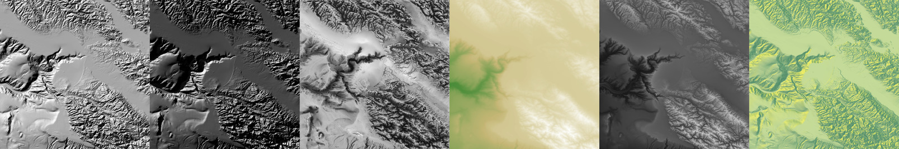
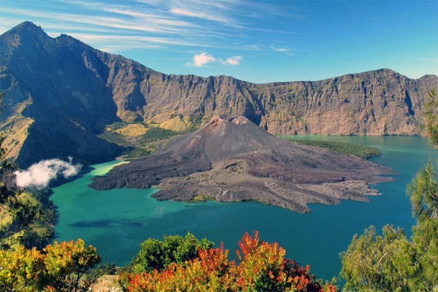

```{r setup, include=FALSE}
# clean up the environment
rm(list = ls())

# setup chunk options
knitr::opts_chunk$set(
  message = FALSE,
  warning = FALSE,
  cache = FALSE,
  fig.align = "center",
  comment = "#>"
)

options(scipen = 9999)
```


# Overview

Dalam dunia pemodelan geospasial, visualisasi data spasial topografi 3D sangatlah penting. Pada course ini, kita akan membahas bagaimana melakukan visualisasi dengan menggunakan library `rayshader` di R dan menghasilkan output yang indah.

Rayshader adalah sebuah library open source yang digunakan dalam bahasa pemrograman R untuk menghasilkan visualisasi peta 3D dan pemodelan topografi dengan tampilan realistis. Library ini diciptakan oleh Tyler Morgan-Wall dan merupakan salah satu library yang paling populer digunakan untuk visualisasi topografi 3D di R. Library ini memungkinkan Anda untuk membuat peta, model gunung, lereng, dan relief lainnya dengan efek 3D yang memukau. Berikut adalah sebuah overview mengenai library Rayshader:

**1. Visualisasi Topografi 3D:**
   - Rayshader memungkinkan Anda untuk membuat visualisasi topografi dalam tampilan 3D yang memungkinkan Anda untuk melihat elevasi dan bentuk permukaan tanah dengan lebih jelas dan mendalam.

**2. Integrasi dengan R:**
   - Library ini dirancang untuk berintegrasi dengan bahasa pemrograman R, yang merupakan bahasa statistik yang sangat kuat. Ini membuatnya mudah digunakan bersama dengan data dan analisis statistik.

**3. Pemodelan Gunung dan Relief:**
   - Anda dapat menggunakan Rayshader untuk membuat pemodelan gunung, lereng, dan relief lainnya dengan berbagai tingkat kompleksitas. Hal ini berguna dalam analisis geospasial dan juga dapat digunakan dalam tujuan pendidikan atau visualisasi ilmiah.

**4. Customisasi Visualisasi:**
   - Rayshader memberikan beragam opsi customisasi untuk memodifikasi tampilan visualisasi Anda. Anda dapat mengatur warna, pencahayaan, dan aspek-aspek lainnya dari visualisasi 3D Anda sesuai dengan preferensi Anda.

**5. Kemampuan Animasi:**
   - Anda dapat membuat animasi yang mengesankan dengan Rayshader, sehingga memungkinkan Anda untuk menjelajahi data topografi secara dinamis dan interaktif.

**6. Mendukung Data Raster dan Matriks:**
   - Rayshader dapat bekerja dengan data raster dan matriks, yang membuatnya cocok untuk berbagai jenis data topografi dan pengukuran.

**7. Komunitas dan Dokumentasi yang Kuat:**
   - Rayshader memiliki komunitas pengguna yang aktif dan dokumentasi yang kaya. Anda dapat menemukan banyak tutorial, contoh, dan dukungan dari komunitas untuk membantu Anda memulai.

**8. Open Source:**
   - Rayshader adalah perangkat lunak open-source, yang berarti Anda dapat mengakses kode sumbernya dan berkontribusi pada pengembangannya.

Rayshader telah menjadi alat yang populer di kalangan ahli geospasial, peneliti, dan pemrogram R untuk membuat visualisasi topografi yang menarik dan informatif. Dengan kemampuannya untuk mengubah data topografi menjadi visualisasi 3D yang menakjubkan, Rayshader adalah alat yang sangat berguna untuk berbagai aplikasi, termasuk pemetaan, penelitian geologi, dan visualisasi data geospasial lainnya.


```{r output_rayshader, echo = FALSE ,fig.align = "center", fig.cap="Rayshader Output"}

```

# Library dan Setup
Untuk dapat mengikuti materi ini, peserta diharapkan sudah menginstall beberapa packages di bawah ini. Apabila package tersebut belum terinstall, silahkan jalankan chunk atau baris kode berikut. Apabila sudah ter-install, lewati chunk berikut dan muat package yang dibutuhkan dengan menjalankan chunk selanjutnya.

```{r install-packages, echo=FALSE}
packages <- c("rayshader", "raster", "dplyr", "ggplot2", "car", "leaflet", "RColorBrewer", "magick", "animation", "osmdata", "sf", "viridis", "terra", "av")

# Check if the packages are already installed
installed_packages <- installed.packages()[, "Package"]
packages_to_install <- setdiff(packages, installed_packages)

if (length(packages_to_install) > 0) {
  install.packages(packages_to_install)
  cat("Packages installed successfully.\n")
} else {
  cat("All required packages are already installed.\n")
}
```

```{r}
library(rayshader)
library(raster)
library(dplyr)
library(ggplot2)
library(car)
library(leaflet)
library(RColorBrewer)
library(magick)
library(animation)
library(osmdata)
library(sf)
library(viridis) 
library(terra)
library(av)
```

```{r echo = FALSE, out.width="55%",fig.align = "center", fig.cap="Illustration Rayshader Output"}
knitr::include_graphics("img/smallfeature.png")
```

# Pembuatan Peta menggunakan library `rayshader`
```{r landscape rinjani, echo=FALSE, fig.align="center", fig.cap="Mount Rinjani"}

```

***


## Data-preprocessing

Materi berikut ini menjelaskan cara membuat peta menggunakan library `rayshader` dalam bahasa pemrograman R. `rayshader` adalah sebuah paket yang digunakan untuk membuat visualisasi peta 3D dari data elevasi topografi. Dalam contoh ini, kita akan menggunakan data elevasi topografi dari situs web "tanahair.indonesia.go.id" dan memprosesnya menggunakan R.

Berikut adalah penjelasan langkah demi langkah beserta kode-kodenya:

1. **Membaca Data TIFF:**
Pertama, kita perlu membaca data TIFF yang akan digunakan. Data TIFF ini berisi informasi elevasi topografi. Kode di bawah ini digunakan untuk membaca data TIFF tersebut. Untuk

Pastikan Anda mengganti lokasi file TIFF (`"dataset/DEMNAS_Rinjani.tif"`) sesuai dengan lokasi penyimpanan data Anda.
   
[DATASET DEMNAS](https://tanahair.indonesia.go.id/demnas/#/demnas)

Anda dapat membaca data TIFF dengan `rast()` dari library terra. Berikut contoh kode lengkapnya:
```{r}
# Baca data TIFF
datatiff <-  rast("dataset/DEMNAS_Rinjani.tif")
```

2. **Cek Spesifikasi Data:**
Setelah membaca data, kita dapat memeriksa spesifikasi data tersebut, seperti batas-batas area yang dicakup oleh data tersebut menggunakan fungsi `ext()`, menggunakan kode berikut:

```{r}
# Cek Spesifikasi Data
ext(datatiff)
```
Ini akan menampilkan informasi mengenai batas-batas data seperti koordinat minimum dan maksimum.

3. **Definisi Extent Baru (Bounding Box):**
Berikutnya, kita akan mendefinisikan extent baru atau bounding box untuk area yang akan di-crop dari data. Anda dapat mengganti nilai-nilai koordinat sesuai dengan area yang ingin Anda fokuskan. Dalam contoh ini, extent baru didefinisikan sebagai berikut:

```{r}
# Definisi extent baru/bounding box area baru untuk cropping
new_extent <- ext(116.3, 116.5, -8.5, -8.3)
```

4. **Memotong Data Raster:**
Dengan extent baru yang telah didefinisikan, kita dapat memotong data raster asli untuk mendapatkan data yang sesuai dengan extent tersebut. Ini dilakukan dengan menggunakan fungsi `crop`.

```{r}
# Memotong data raster
croptiff <- crop(datatiff, y = new_extent)
```

5. **Menyimpan Data yang Telah Dipotong:**
Data yang telah dipotong dapat disimpan dalam format TIFF yang baru dengan menggunakan kode berikut:

```{r}
# Simpan data yang telah dipotong ke file GeoTIFF dengan ekstensi .tif
# writeRaster(data_raster, filename = "path/filename.tif", overwrite = TRUE)
writeRaster(croptiff, filename = "HASIL_CROP.tif", overwrite = TRUE)
```
Dalam kode di atas, data dipotong disimpan dengan nama file "rinjani_crop.tif". Anda dapat mengganti nama file sesuai dengan kebutuhan Anda.

6. **Membuat Plot Peta:**
   Terakhir, kita dapat membuat plot peta menggunakan data yang telah dipotong. Dalam contoh ini, kita menggunakan fungsi `plot` untuk membuat peta.
   
```{r}
plot(datatiff)
plot(croptiff)
```
Kode ini akan menghasilkan plot peta 2D dari area yang telah dipotong dengan warna yang sesuai.

Dengan mengikuti langkah-langkah di atas, Anda dapat membuat peta dengan menggunakan library `rayshader` dalam bahasa pemrograman R menggunakan data elevasi topografi yang telah Anda persiapkan. Pastikan untuk mengganti lokasi file TIFF, extent baru, dan nama file sesuai dengan data dan kebutuhan Anda.

***

## Pembuatan Visualisasi 2D
Ini adalah bagian dari langkah-langkah untuk membuat visualisasi peta dengan penerapan berbagai fungsi dan pemrosesan data. Mari kita bahas kode ini langkah demi langkah:
Kode yang Anda berikan terkait dengan pembuatan visualisasi 2D menggunakan bahasa pemrograman R dengan bantuan berbagai paket seperti `raster`, `sp`, `leaflet`, dan lainnya. Ini adalah bagian dari langkah-langkah untuk membuat visualisasi peta dengan penerapan berbagai fungsi dan pemrosesan data. Mari kita bahas kode ini langkah demi langkah:


1. **Penentuan Batasan Area (Bounding Box):**
   - Kode pertama ini menentukan batasan area yang akan digunakan dalam visualisasi peta. Batasan ini didefinisikan dengan menyimpan lintang (`lat_range`) dan bujur (`long_range`) dalam bentuk rentang koordinat geografis. Dalam kasus ini, area yang dibatasi adalah lintang -8.5 hingga -8.3 dan bujur 116.3 hingga 116.5. Bisa didapatkan secara otomatis dari [bboxfinder](http://bboxfinder.com/).

```{r}
# add bounding box to add osm map
lat_range  <-  c(-8.5, -8.3)
long_range <- c(116.3, 116.5)
```
   
2. **Konversi Data Raster Menjadi Matriks:**
   - Kode ini mengambil data raster `croptiff` dan mengonversinya ke dalam bentuk matriks dengan menggunakan fungsi `raster_to_matrix`. Hasil konversi disimpan dalam variabel `tiffmat`.
   
```{r}
# Konversi Data
tiffmat <- raster_to_matrix(croptiff)
```

3. **Resize Matriks:**
   - Selanjutnya, kode ini mengubah ukuran matriks yang telah dihasilkan (`tiffmat`) dengan faktor resize sebesar 0.4. Hasil resize disimpan dalam variabel `tiff_bali`. Namun, pada kode yang diberikan, variabel `croptiff` yang digunakan di kode ini tidak didefinisikan sebelumnya. Pastikan `croptiff` adalah data raster yang telah dibaca dan diproses sebelumnya.
   
```{r}
# Resize
tiff_bali <- resize_matrix(heightmap = tiffmat, scale = 0.4)
```


4. **Input Data Raster ke `Leaflet`:**
   - Terakhir, mari kita coba memasukkan data raster kedalam leaflet agar bisa langsung mendapatkan lokasi dan basemap menggunakan library `leaflet` dengan input data raster tiff. 

```{r}

# Definisikan palet warna yang merepresentasikan elevasi
palet <-rev(terrain.colors(50))


# Definisikan palette warna berdasarkan elevasi dalam data raster
pal <- colorNumeric(palet,
                    values(croptiff),
                    na.color = "transparent")

# Konversi data raster dari terra ke raster
croptiff_raster <- raster(croptiff)

# leaflet() %>%
#   addProviderTiles("Stamen.Terrain") %>%
#   addRasterImage(croptiff_raster, colors = pal, opacity = 0.6) %>%
#   addLegend(pal = pal, values = values(croptiff), title = "Elevasi")

leaflet() %>%
  addProviderTiles("Stamen.Terrain") %>%
  addRasterImage(croptiff_raster, colors = pal, opacity = 0.6) %>%
  addLegend(pal=pal, values = values(croptiff), title = "Elevasi")

# # Install dan load library mapview
# library(mapview)
# # Membuat tampilan peta dengan mapview
# map <- mapview() %>% 
#   addTiles("Stamen.Terrain") +
#   addMarkers(lng = 116.458, lat = -8.411, popup = "Gunung Rinjani") +
#   addRasterImage(croptiff, col = pal, opacity = 0.6) +
#   addLegend(colors = pal, values = values(croptiff), title = "Elevasi") +
#   addMouseCoordinates()
```

***

# Intro to Rayshader Packages
Berikut ini bagian dari penggunaan paket `rayshader` di R untuk membuat visualisasi peta 3D. Paket ini memungkinkan Anda untuk membuat visualisasi topografi berdasarkan data elevasi. Di bawah ini, saya akan menjelaskan setiap blok kode secara terpisah:

1. **Penggunaan `height_shade()` dan `plot_map()`:**

```{r}
# Code here
tiff_bali %>% height_shade() %>%  plot_map()
```
Kode diatas digunakan untuk menghasilkan visualisasi 3D dari data elevasi yang disimpan dalam `tiff_bali`. `height_shade()` digunakan untuk memberikan bayangan dan highlight pada visualisasi berdasarkan elevasi, sehingga memberikan efek 3D yang lebih baik. Kemudian, `plot_map()` digunakan untuk menggambar peta hasil visualisasi tersebut.

2. **Penggunaan Tekstur dengan `sphere_shade()`:**

```{r}
# Add tekstur
tiff_bali %>% sphere_shade(texture ="desert") %>%  plot_map()

```
Kode diatas menunjukkan penggunaan tekstur dengan `sphere_shade()`. Fungsi ini menghasilkan efek tekstur pada visualisasi 3D. Dalam contoh ini, tekstur "desert" digunakan. Setelah menerapkan tekstur, `plot_map()` digunakan lagi untuk menggambar visualisasi 3D dengan tekstur.

3. **Penggunaan Lapisan Air dengan `detect_water()` dan `add_water()`:**

```{r}
# Add water
tiff_bali %>% 
  sphere_shade(texture ="desert") %>% 
  add_water(detect_water(tiff_bali), color="desert") %>% 
  plot_map()

```
Kode ini menambahkan lapisan air ke visualisasi. `detect_water()` digunakan untuk mendeteksi area-air dalam data `tiff_bali`, dan kemudian `add_water()` digunakan untuk menambahkan lapisan air tersebut ke visualisasi dengan warna yang sesuai.

4. **Penggunaan Bayangan dengan `add_shadow()` dan `ray_shade()`:**
```{r}
# Add sun direction effect
tiff_bali %>% 
  sphere_shade(texture ="desert") %>% 
  add_water(detect_water(tiff_bali), color="desert") %>% 
  add_shadow(ray_shade(tiff_bali)) %>% 
  plot_map()

```

***

# Peta 3D
Mari kita coba buat visualisasi peta diatas menjadi peta 3D dengan berbagai efek seperti tekstur, lapisan air, bayangan, dan perspektif yang berbeda menggunakan library rayshader.

## 3D Sederhana
Kode ini melanjutkan dari kode sebelumnya yang telah digunakan untuk menghasilkan visualisasi 3D dengan tekstur, lapisan air, dan bayangan pada data elevasi (`tiff_bali`). Menggunakan `plot_3d()`.

```{r}
# Code here
tiff_bali %>% 
  sphere_shade(texture ="desert") %>% 
  add_water(detect_water(tiff_bali), color="desert") %>% 
  add_shadow(ray_shade(tiff_bali)) %>% 
  plot_3d(tiff_bali, zscale = 6) %>% 
  plot_map()
```

Note: 
- **sphere_shade():** Fungsi ini memberikan efek tekstur pada visualisasi 3D. Dalam contoh ini, tekstur "desert" digunakan.

- **add_water():** Fungsi ini menambahkan lapisan air ke visualisasi berdasarkan deteksi air menggunakan `detect_water()`. Lapisan air ini memiliki warna yang sesuai dengan tekstur "desert".

- **add_shadow():** Fungsi ini menambahkan bayangan ke visualisasi. Dalam kode ini, ada dua jenis bayangan yang ditambahkan: bayangan berdasarkan cahaya matahari (`ray_shade()`) dengan faktor penskalaan `zscale = 6`, dan bayangan ambient (`ambient_shade()`) dengan faktor 0 (tidak ada bayangan ambient).

- **plot_3d():** Fungsi `plot_3d` dalam paket `rayshader` digunakan untuk menggambar visualisasi peta 3D. Parameter-parameter yang ada dalam fungsi `plot_3d` memengaruhi tampilan dan perspektif visualisasi tersebut. Di bawah ini adalah penjelasan parameter-parameter yang digunakan dalam kode Anda:

  1. **tiff_bali:** Ini adalah data elevasi yang digunakan untuk membuat visualisasi. Data ini adalah dasar visualisasi 3D.

  2. **zscale:** Parameter ini mengontrol tingkat penskalaan dalam sumbu z (elevasi) dalam visualisasi. Semakin tinggi nilainya, semakin besar perbedaan ketinggian dalam visualisasi. Sebaliknya, semakin rendah nilai `zscale`, semakin datar visualisasi tersebut.

  3. **fov:** Fov (Field of View) mengontrol sudut pandang (bidang pandang) dari visualisasi. Semakin tinggi nilai `fov`, semakin luas bidang pandangnya. Sebaliknya, semakin rendah nilai `fov`, semakin sempit bidang pandangnya.

  4. **theta:** Parameter ini mengontrol sudut horizontal visualisasi. Nilai positif akan menggeser visualisasi ke kanan, sedangkan nilai negatif akan menggesernya ke kiri.

  5. **phi:** Parameter ini mengontrol sudut vertikal visualisasi. Nilai positif akan mengangkat pandangan ke atas, sedangkan nilai negatif akan menurunkannya.

  6. **windowsize:** Ini mengatur ukuran jendela visualisasi dalam piksel. Semakin besar nilai `windowsize`, semakin besar visualisasi yang akan dihasilkan.

  7. **zoom:** Parameter ini mengontrol tingkat zoom visualisasi. Nilai yang lebih tinggi akan memberikan efek zoom yang lebih besar, sementara nilai yang lebih rendah akan memberikan efek zoom yang lebih kecil.

> Perubahan pada parameter-parameter ini akan memengaruhi tampilan dan perspektif visualisasi 3D. Anda dapat bereksperimen dengan mengganti nilai-nilai ini untuk melihat bagaimana visualisasi 3D berubah sesuai dengan perubahan parameter-parameter tersebut. Misalnya, meningkatkan `zscale` akan menghasilkan peta yang lebih bergelombang, mengubah `fov` akan memengaruhi sudut pandang, dan mengubah `theta` dan `phi` akan mengubah orientasi visualisasi.

- **Sys.sleep(0.2):** Ini adalah perintah untuk memberikan jeda selama 0.2 detik sebelum rendering dilakukan. Hal ini digunakan untuk memberikan waktu bagi visualisasi untuk siap sebelum diproses lebih lanjut.

- **render_snapshot():** Ini adalah perintah yang digunakan untuk mengambil snapshot dari visualisasi yang telah dibuat. Rendering mungkin memerlukan waktu beberapa saat tergantung pada kompleksitas visualisasi.

***

## 3D dengan Legenda dan Efek Tambahan

Membuat visualisasi peta 3D yang dinamis dengan legenda, scale bar, dan kompas, serta untuk membuat serangkaian bingkai (frames) yang nantinya dapat digunakan untuk membuat animasi visualisasi 3D. Berikut ini adalah penjelasan kode tersebut:

```{r}
montshadow = ray_shade(tiff_bali, zscale = 66, lambert = FALSE)
montamb = ambient_shade(tiff_bali, zscale = 6)

tiffmat_viz <- tiff_bali %>%
  sphere_shade(texture = "imhof1") %>%
  add_shadow(montshadow, 0.5) %>%
  add_shadow(montamb, 0) %>%
  add_water(detect_water(tiff_bali), color = "lightblue") %>%
  plot_3d(tiff_bali, zscale = 6, fov = 0, theta = 60, zoom = 0.75, phi = 45)

render_scalebar(limits=c(0, 5, 10),label_unit = "km",position = "W", y=50,
                scale_length = c(0.33,1))

render_compass(position = "E")
Sys.sleep(0.2)
```

Note:

1. **ray_shade() dan ambient_shade():** Dalam blok ini, Anda menghasilkan bayangan berdasarkan cahaya matahari dengan `ray_shade()` dan bayangan ambient dengan `ambient_shade()`. Ini digunakan untuk memberikan efek bayangan pada visualisasi 3D.

2. **sphere_shade(), add_shadow(), add_water():** Anda menggunakan fungsi-fungsi ini untuk memberikan efek tekstur pada visualisasi (`sphere_shade()`), menambahkan bayangan dari bayangan cahaya matahari dan ambient (`add_shadow()`), dan menambahkan lapisan air ke visualisasi (`add_water()`). Semua ini untuk memperkaya tampilan visualisasi.

3. **render_scalebar():** Fungsi ini digunakan untuk menambahkan skala (scale bar) ke visualisasi. Anda dapat mengatur batas skala, unit label, posisi, panjang skala, dan lain-lain.

4. **render_compass():** Ini digunakan untuk menambahkan kompas ke visualisasi dengan mengatur posisinya.

***

# Save 3D .mp4/.gif

Untuk menyimpan visualisasi 3D yang dibuat rayshader sebagai file MP4/GIF, Anda dapat menggunakan fungsinya `rayshader::render_movie()`. Fungsi ini memungkinkan Anda membuat Mp4 atau GIF animasi dengan melakukan iterasi melalui berbagai sudut pandang plot 3D. Untuk bisa melakukan rendering movie, kita butuh packages `av` untuk render .mp4 sedangkan untuk .gif memerlukan library `gifski`.

Berikut cara memodifikasi kode untuk menyimpan visualisasi sebagai MP4:

```{r}
# Run chunk below
montshadow = ray_shade(tiff_bali, zscale = 6, lambert = FALSE)
montamb = ambient_shade(tiff_bali, zscale = 6)

# add 3d map
tiff_bali %>%
  sphere_shade(texture = "imhof1") %>%
  add_shadow(montshadow, 0.5) %>%
  add_shadow(montamb, 0) %>%
  add_water(detect_water(tiff_bali), color = "lightblue") %>%
  plot_3d(tiff_bali, zscale = 6, fov = 0, theta = 60, zoom = 0.75, phi = 45)

# add scalebar
render_scalebar(limits = c(0, 5, 10),label_unit = "km", position = "W", y = 50,
                scale_length = c(0.33,1))
# add compass
render_compass(position = "E")
#
# `av` package required for render_movie()
# magick::image_annotate -> untuk menggunakan title

render_movie(filename = "3D_RinjaniMount.mp4", type = "oscillate",
            frames = 60, fps = 30,  phi = 30, theta = 90,
            title_text = "Mount Rinjani 3D Map Using Rayshader Packages")
```

# Open Street Map (OSM)
Langkah Pembuatan peta diatas masih sebatas visualisasi 2D data topografi menjadi 3D menggunakan rayshader. Namun, dalam dunia kartografi peta diattas masih belum memnuhi syarat kaidah kartografi. Sehingga kita bisa menambahkan informasi lain seperti jaringan jalan, aliran sungai, tempat-tempat umum, dan sebaginya.

Rayshader menyediakan fungsi untuk dengan mudah untuk menambahkan poligon, garis, dan titik yang mewakili data kita secara langsung ke peta. Tanpa perlu susah payah mencari data yang sesuai dengan 3D maps kita diatas. Sumber data yang bisa kita gunakan secara langsung adalah dengan Open Street Map. 

`Open Street Map (OSM):` peta gratis, terbuka, yang dibuat oleh pengguna untuk hampir semua yang ada dimuka bumi. Jika kita memiliki dataset yang sangat khusus, kita mungkin tidak dapat menemukannya di OSM, tetapi untuk dasar-dasar (jalur, jalan, sungai, aliran, landmark, dan bangunan) cukup komprehensif bisa kita dapatkan di OSM.


```{r}
# Cek data raster yang sudah tercrop diatas
tiff_bali
```

Membuat bounding box langsung dari `lat_range` dan `long_range` tanpa mengubah koordinat ke sistem lain, dan ingin menjadikannya sesuai dengan koordinat referensi dari data raster yang sudah didefinisikan dalam `EPSG:4326`, Kita dapat melakukannya sebagai berikut:

```{r}
## Run code below
# Definisikan dulu CRS untuk EPSG:4326
crs_4326 <- CRS("EPSG:4326")

# koordinat batas area kajian untuk crop raster diatas
lat_range  <-  c(-8.5, -8.3)
long_range <- c(116.3, 116.5)

# Buat bounding box dari lat_range dan long_range
bbox <- c(long_range[1], long_range[2], lat_range[1], lat_range[2])

# Hasilkan objek SpatExtent
bbox <- ext(bbox)
bbox
```


## Mengambil data OSM (Jaringan Jalan)
Untuk mengambil data dari osm, kita hanya perlu menggunakan fungsi opq() dan add_osm_feature()
```{r}
# Define bounding box
osm_bbox <- c(left = 116.3, bottom = -8.5, right = 116.5, top = -8.3)

# Query OSM data untuk layer jaringan jalan
rinjani_highway <-  opq(bbox = osm_bbox) %>% 
  add_osm_feature(key = "highway") %>% 
  osmdata_sf()

rinjani_highway$osm_line
```

```{r}
# Print the result
rinjani_highway
```

```{r}
# rinjani_highway$osm_lines
unique(rinjani_highway$osm_lines$highway)
```
Tipe jalan dalam OpenStreetMap yang dapat ditemukan melalui scraping (pengambilan data) dengan menggunakan R. Berikut adalah penjelasan dalam bahasa Indonesia untuk masing-masing kata kunci tersebut:

`path`: Jalur setapak atau jalan kecil yang biasanya digunakan oleh pejalan kaki atau sepeda.

`service`: Jalan yang menghubungkan berbagai fasilitas atau akses ke area tertentu, seperti akses ke bangunan komersial atau industri.

`tertiary`: Jalan berukuran menengah yang menghubungkan daerah kecil atau pemukiman.

`unclassified`: Jalan yang tidak memiliki klasifikasi yang jelas, sering digunakan untuk jalan lokal yang bukan merupakan arteri utama.

`residential`: Jalan di dalam pemukiman atau perumahan.

`track`: Jalur atau jalan khusus yang mungkin digunakan oleh kendaraan off-road atau traktor.

`secondary`: Jalan yang lebih besar dari jalan lokal dan sering menghubungkan daerah yang lebih besar.

`steps`: Tangga atau anak tangga untuk pejalan kaki.

`footway`: Jalan atau jalur khusus untuk pejalan kaki.

Setiap tipe jalan ini memiliki karakteristik dan fungsi yang berbeda dalam peta OpenStreetMap. Penggunaan kata kunci ini dapat membantu Anda mengidentifikasi jenis jalan yang ada dalam data yang diambil dari OpenStreetMap menggunakan R.

```{r}
# Cek hasil scrapping data jaringan jalan:
ggplot() +
  geom_sf(data = rinjani_highway$osm_lines, aes(color = highway)) +
  labs(title = "Open Street Map `highway` attribute in Mount Rinjani National Park")
```

```{r}
# hasil scrap osm highway -> ambil osm_lines saja
rinjani_lines <- st_transform(rinjani_highway$osm_lines, crs = crs(croptiff))
```

```{r}
unique(rinjani_highway$osm_lines$highway)
```

## Simpan kedalam nama objek berdasarkan kelompoknya
Untuk pengelompokkan ini bisa disesuaikan berdasarkan peraturan dari kartografis:
```{r}
## Run Code Below:
trails <-  rinjani_lines %>%
  filter(highway %in% c("path", "track"))

footpaths <-  rinjani_lines %>%
  filter(highway %in% c( "steps", "footway"))

roads <-  rinjani_lines %>%
  filter(highway %in% c(
    "tertiary",
    "service",
    "unclassified",
    "residential",
    "secondary"
  ))
```

# Layering OSM kedalam Peta 3D 

## Membuat Basemap Peta 3D/Hilshade
Tahap ini akan menghasilkan basemap dari peta topografi menggunakan DEMNAS, dimana nanti akan dilanjutkan dengan layering dari shp jaringan jalan yang diambil dari scrapping data OSM menggunakan library(osmdata).

```{r}
## Pembuatan basemap
# Disclaimer: Running lama
# tiff_zoom <-  crop(croptiff, bbox) 
# tiff_zoom_mat <-  raster_to_matrix(tiff_zoom)
# 
# base_map <-  tiff_zoom_mat %>% 
#   height_shade() %>%
#   add_overlay(sphere_shade(tiff_zoom_mat,
#                            texture = "desert",
#                            colorintensity = 5),
#               alphalayer = 0.5) %>%
#   add_water(detect_water(tiff_zoom_mat), color = "lightblue") %>%
#   add_shadow(lamb_shade(tiff_zoom_mat), 0) %>%
#   add_shadow(texture_shade(
#     tiff_zoom_mat,
#     detail = 5 / 10,
#     contrast = 8,
#     brightness = 12
#   ),
#   0.1)
# 
# plot_map(base_map)
```

[Optional] Export Map 3D PNG/TIFF
```{r}
# Simpan peta sebagai file PNG
# save_png(hillshade = base_map, filename = "base_rinjani.png")  # Pengaturan lebar, tinggi, dan resolusi
```

```{r}
# Simpan peta sebagai file TIFF
# tiff("base_rinjani.tif", width = 3000, height = 3000, units = "px", res = 300)
```

**Penjelasan kode diatas:**
  - `extent_zoomed` = extent(utm_bbox[1], utm_bbox[2], utm_bbox[3], utm_bbox[4]): Kode ini membuat objek extent_zoomed yang merupakan batasan (extent) dari area yang akan di-zoom. Nilai utm_bbox adalah koordinat batas wilayah dalam sistem koordinat Universal Transverse Mercator (UTM).
  
  - `tiff_zoom` = crop(croptiff, extent_zoomed): Kode ini melakukan pemangkasan (crop) citra croptiff berdasarkan extent yang telah di-zoom sebelumnya. Hasilnya adalah citra yang difokuskan pada area tertentu.
  
  - `tiff_zoom_mat` = raster_to_matrix(tiff_zoom): Kode ini mengubah citra yang telah di-zoom menjadi matriks data yang akan digunakan dalam visualisasi.
  
  - `base_map` = tiff_zoom_mat %>% ...: Kode ini memulai pembentukan visualisasi dasar menggunakan pustaka rayshader. Ini melibatkan penggunaan berbagai efek seperti bayangan, tekstur, dan cahaya untuk memberikan tampilan tiga dimensi yang realistis.
  
  - `plot_map(base_map)`: Kode ini akan menghasilkan plot akhir dari visualisasi yang telah dibentuk sebelumnya.

Hasil output diatas memakan banyak waktu rendering dikarenakan library `rayshader` yang digunakan menghasilkan visualisasi yang kompleks tergantung pada ukuran data dan kompleksitas efek yang diterapkan. 

Sehingga, untuk mengurangi waktu rendering:
1. `Ukuran Data`: Pastikan data yang gunakan tidak terlalu besar. Jika ukuran citra atau data yang gunakan terlalu besar, pertimbangkan untuk menguranginya atau menggunakan citra dengan resolusi lebih rendah untuk pengujian.

2. `Kompleksitas Efek`: Beberapa efek, seperti tekstur, bayangan, dan cahaya, dapat memakan waktu pemrosesan yang lebih lama. Kita dapat mencoba mengurangi kompleksitas efek atau mengatur parameter seperti detail, contrast, dan brightness untuk mengurangi beban pemrosesan.

3. `Komputer Hardware`: Memiliki komputer dengan spesifikasi yang lebih tinggi, seperti RAM yang cukup dan CPU yang cepat, dapat membantu mengurangi waktu pemrosesan.

4. `Pemutakhiran Pustaka`: Pastikan menggunakan versi terbaru dari pustaka rayshader dan juga versi terbaru dari R. Pemutakhiran ini mungkin mengandung perbaikan performa.

5. `Pra-Pemrosesan`: Kita dapat memotong dan memproses data sebelumnya untuk mengurangi waktu yang dibutuhkan selama pemrosesan visualisasi (Seperti yang sudah dilakukan diatas, dengan crop berdasarkan bounding box yang diinginkan).

Note : Penting untuk diingat bahwa pengurangan waktu loading sering kali melibatkan kompromi pada kompleksitas visualisasi atau kualitas akhir. Jika visualisasi terlalu kompleks atau ukuran datanya terlalu besar, ada batas atas pada seberapa cepat visualisasi tersebut dapat dihasilkan.

***

# Penambahan layer jaringan jalan

```{r}
# save layer jaringan jalan
trails_layer <- generate_line_overlay(footpaths, extent = bbox,
                                     linewidth = 14, color = "black",
                                     heightmap = tiff_zoom_mat) %>%
  
  add_overlay(generate_line_overlay(footpaths, extent = bbox,
                                    linewidth = 10, color = "white",
                                    heightmap = tiff_zoom_mat)) %>%
  
  add_overlay(generate_line_overlay(trails, extent = bbox,
                                    linewidth = 8, color = "white", lty = 3,
                                    heightmap = tiff_zoom_mat)) %>%
  
  add_overlay(generate_line_overlay(roads, extent = bbox,
                                    linewidth = 12, color = "black",
                                    heightmap = tiff_zoom_mat))
```


```{r}
# Cek peta basemap + layer jaringan jalan tanpa simpan kedalam objek
base_map %>%
  add_overlay(generate_line_overlay(footpaths,extent = bbox,
                                    linewidth = 14, color="black",
                                    heightmap = tiff_zoom_mat)) %>%
  add_overlay(generate_line_overlay(footpaths,extent = bbox,
                                    linewidth = 10, color="white",
                                    heightmap = tiff_zoom_mat)) %>%
  add_overlay(generate_line_overlay(trails,extent = bbox,
                                    linewidth = 8, color="white", lty=3,
                                    heightmap = tiff_zoom_mat)) %>%
  add_overlay(generate_line_overlay(roads,extent = bbox,
                                    linewidth = 12, color="black",
                                    heightmap = tiff_zoom_mat)) %>%
  plot_map()
```

# Add Waterway

Setelah menambahkan beberapa fitur jaringan jalan, mari kita coba memberikan fitur tubuh air dengan scrapping osm_feature `waterway`.

```{r}
# menambahkan aliran sungai
rinjani_water  <-  opq(osm_bbox) %>%
  add_osm_feature("waterway") %>%
  osmdata_sf()
rinjani_water
```


```{r}
ggplot() +
  geom_sf(data = rinjani_water$osm_lines, aes(color = waterway)) +
  labs(title = "Open Street Map `waterway` attribute in Mount Rinjani National Park")
```

```{r}
# Assign CRS to Waterway
streams <-  st_transform(rinjani_water$osm_lines, crs = crs(croptiff))

stream_layer <-  generate_line_overlay(streams, extent = bbox,
                                       linewidth = 10, color = "skyblue2",
                                       heightmap = tiff_zoom_mat)
```


# Add feature polygon bangunan

```{r}
# bangunan
building <-  opq(osm_bbox) %>% 
  add_osm_feature("building") %>% 
  osmdata_sf() 

# fasilitas umum turis
tourism <-  opq(osm_bbox) %>% 
  add_osm_feature("tourism") %>% 
  osmdata_sf() 

building_poly <-  st_transform(building$osm_polygons,crs=crs(croptiff))
tourism_poly <-  st_transform(tourism$osm_polygons,crs=crs(croptiff))
```

```{r}
# Cek unik
unique(building_poly$name)
unique(building_poly$building)
```

```{r}
building_name <- building_poly %>% filter(name %in% c("Rinjani Treking Center (abandoned)","Bukit Senaru Homestay"))
building_build <- building_poly %>% filter(building %in% c("mosque","school", "house"))
```

# Combine Feature layer polygon and waterwayand roads
```{r}
polygon_layer <-  generate_polygon_overlay(building_name, extent = bbox,
                                           heightmap = tiff_zoom_mat, palette = "grey30") %>%
  add_overlay(generate_polygon_overlay(building_build, extent = bbox,
                                       heightmap = tiff_zoom_mat, palette="darkred"))

# Melihat peta dengan layer-layer
#. Menambahkan objek yang ada keterangan _layer.
base_map %>% 
  add_overlay(polygon_layer) %>%
  add_overlay(stream_layer) %>% 
  add_overlay(trails_layer) %>%
  plot_map()
```

# Add point from building 
```{r}
# unique(tourism$osm_points$name)
tourism_points <-  st_transform(tourism$osm_points,crs=crs(croptiff))

# Membuang titik-titik yang NA
tourism_point <-  tourism_points %>% 
  filter(name != "NA")
```

Langkah-langkah untuk membuat peta interaktif atau statis dengan berbagai lapisan yang berisi informasi geospasial seperti poligon, garis, titik, dan label. Lapisan-lapisan ini kemudian disatukan dalam satu peta dengan judul "Rinjani Mountain". Berikut code nya:
```{r}
base_map %>% 
  add_overlay(polygon_layer) %>%
  add_overlay(stream_layer, alphalayer = 0.8) %>% 
  add_overlay(trails_layer) %>%
  # Menambahkan label titik lokasi
  add_overlay(generate_label_overlay(tourism_point, extent = bbox,
                                     text_size = 4, point_size = 2,
                                     halo_color = "white", halo_expand = 10, 
                                     halo_blur = 20, halo_alpha = 0.8,
                                     seed = 1,
                                     heightmap = tiff_zoom_mat, data_label_column = "name")) %>% 

  plot_map(title_text="Rinjani Mountain", title_color = "white",
           title_bar_alpha = 1, title_bar_color = "black")

# # Run this code
# tiff("3dMapwithOSM.tif", width = 3000, height = 3000, units = "px", res = 300)
```

1. `base_map %>%`: Objek peta dasar (`base_map`)

2. `add_overlay(polygon_layer) %>%`: Menambahkan lapisan `polygon_layer` sebagai lapisan pertama ke dalam peta dasar (`base_map`). Lapisan berisi poligon atau bentuk-bentuk geometri lainnya yang akan ditambahkan ke peta.

3. `add_overlay(stream_layer, alphalayer = 0.8) %>%`: Menambahkan lapisan `stream_layer` sebagai lapisan kedua ke dalam peta. Parameter `alphalayer = 0.8`, mengatur tingkat transparansi lapisan ini menjadi 80%.

4. `add_overlay(trails_layer) %>%`: Menambahkan lapisan `trails_layer` sebagai lapisan ketiga ke dalam peta.

5. `add_overlay(generate_label_overlay(tourism_point, extent = bbox, ...)) %>%`: Ini adalah operasi yang lebih kompleks. Kita ingin menambahkan label pada peta dengan menggunakan fungsi `generate_label_overlay`. Parameter yang digunakan dalam fungsi ini adalah sebagai berikut:
   - `tourism_point`: Ini adalah lapisan yang berisi titik-titik yang akan diberi label di peta.
   - `extent = bbox`: Parameter ini mengatur batas peta (bounding box) untuk menentukan di mana label-label ini akan ditempatkan.
   - `text_size = 4`: Mengatur ukuran teks label.
   - `point_size = 2`: Mengatur ukuran titik atau marker pada titik-titik yang diberi label.
   - `halo_color = "white"`, `halo_expand = 10`, `halo_blur = 20`, `halo_alpha = 0.8`: Parameter-parameter ini digunakan untuk mengatur efek bayangan atau "halo" di sekitar teks label.
   - `seed = 1`: Ini adalah angka acak yang digunakan untuk mengatur posisi label.
   - `heightmap = tiff_zoom_mat`: Parameter ini digunakan untuk mengatur tinggi dari label pada peta.
   - `data_label_column = "name"`: Ini mengacu pada kolom "name" dalam lapisan `tourism_point` yang akan digunakan sebagai teks label.

6. `plot_map(title_text="Rinjani Mountain", title_color = "white", ... )`: Menampilkan peta dengan judul "Rinjani Mountain". Parameter lainnya seperti `title_color` dan sebagainya digunakan untuk mengatur penampilan judul peta.


```{r}
# save_png(hillshade = base_map, filename = "3dMapwithOSM.png")  # Pengaturan lebar, tinggi, dan resolusi
```

```{r}
# # Don't Run This Code
# base_map %>% 
#   add_overlay(polygon_layer) %>%
#   add_overlay(stream_layer, alphalayer = 0.8) %>% 
#   add_overlay(trails_layer) %>%
#   add_overlay(generate_label_overlay(tourism_point, extent = extent_zoomed,
#                                      text_size = 3, point_size = 2,
#                                      halo_color = "white", halo_expand = 10, 
#                                      halo_blur = 20, halo_alpha = 0.8,
#                                      seed = 1,
#                                      heightmap = tiff_zoom_mat, data_label_column = "name")) %>% 
#   plot_3d(heightmap = tiff_zoom_mat,
#           zscale = 5, fov = 0,
#           theta = 60, phi = 45,
#           water = TRUE, waterdepth = 4,
#           wateralpha = 0.4, watercolor = "lightblue",
#           waterlinecolor = "white", waterlinealpha = 0.5,
#           background = "white")
# 
# # Create 2D snapshot of 3D rendering
# render_scalebar(limits=c(0, 5, 10),label_unit = "km",position = "W", y=50,
#                 scale_length = c(0.33,1))
# 
# render_compass(position = "E")
# 
# # Render dibawah ini perlu update FFMPEG packages
# # render_movie(filename = "3D_OSM.mp4", type = "oscillate",
# #             frames = 60,  phi = 30, theta = -90,
# #             title_text = "Mount Rinjani 3D Map Using Rayshader Packages")
```

# References:
1. [osmdata repository](https://github.com/ropensci/osmdata)
2. [osmdata package vignette](https://cran.r-project.org/web/packages/osmdata/vignettes/osmdata.html)
3. [ggplot2 package](https://ggplot2.tidyverse.org/)
4. [ggmap package documentation](https://www.rdocumentation.org/packages/ggmap/versions/3.0.0/topics/get_map)
5. [‘Accessing Open Street Map data with R’](https://dominicroye.github.io/en/2018/accessing-openstreetmap-data-with-r/)
6. [Geocomputation with R](https://geocompr.robinlovelace.net/)
7. [Spatial Data Science with applications in R](https://keen-swartz-3146c4.netlify.app/)
 


