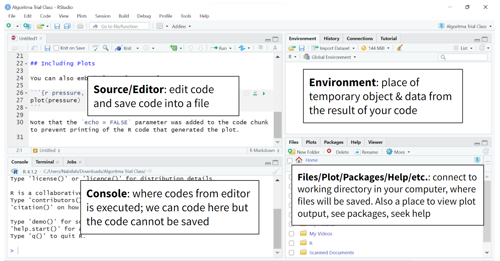
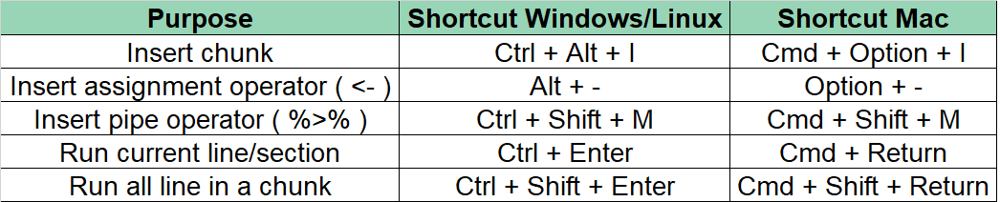
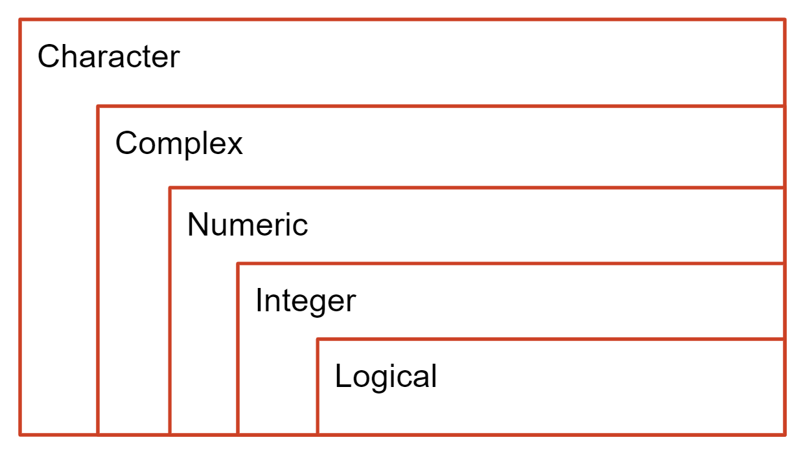

```{r setup, include=FALSE}
# clean up the environment
rm(list = ls())

# setup chunk options
knitr::opts_chunk$set(
  message = FALSE,
  warning = FALSE,
  cache = FALSE,
  fig.align = "center",
  comment = "#>"
)

options(scipen = 9999)
```


Materi ini diproduksi oleh tim dari Algoritma untuk **Memperkenalkan data geospasial untuk keperluan visualisasi tidak hanya 2D melainkan 3D**. Materi berikut hanya ditujukan untuk kalangan terbatas, meliputi individu/personal yang menerima materi ini secara langsung dari lembaga pelatihan. Materi ini *dilarang* untuk direproduksi, didistribusikan, diterjemahkan, atau diadaptasikan dalam bentuk apapun di luar izin dari individu dan organisasi yang berkepentingan.

**Algoritma** adalah pusat pendidikan Data Science di Jakarta. Kami mengadakan workshop dan program pelatihan untuk membantu para profesional dan pelajar untuk mendapatkan keahlian dalam berbagai bidang dalam ruang lingkup Data Science: data visualization, machine learning, data modeling, statistical inference, dan lain-lainnya.

Sebelum masuk ke dalam materi dan menjalankan kode-kode di dalam materi ini, silakan anda melihat bagian **Library/Packages Preparation** untuk melihat dan memastikan semua persyaratan dasar untuk mengikuti materi ini sudah terpenuhi termasuk package-package yang diperlukan. Pada bagian **Tujuan Pembelajaran** anda dapat melihat secara umum apa saja yang akan dipelajari dalam modul materi ini. Kami harap materi ini akan bermanfaat bagi karir ataupun menambah keahlian peserta.

# Preface {.tabset}

## Pendahuluan

Dalam era digital dan informasi yang terus berkembang, data geospasial menjadi sangat penting dalam berbagai bidang seperti pemetaan, pemodelan lingkungan, analisis berbasis lokasi, pengambilan keputusan bisnis, dan pemantauan geografis. Penggunaan data geospasial yang efektif membutuhkan keterampilan analisis dan visualisasi yang kuat, serta pemahaman tentang bahasa pemrograman yang dapat memanipulasi dan memproses data geospasial dengan efisien. Pelatihan Geospasial Visualisasi menggunakan bahasa pemrograman R ini dirancang untuk memperkenalkan peserta dengan alat-alat dan teknik yang diperlukan untuk menganalisis dan memvisualisasikan data geospasial menggunakan bahasa pemrograman R. R merupakan bahasa pemrograman yang populer di kalangan ilmuwan data dan analis statistik, dan telah menjadi salah satu pilihan lain dalam analisis dan visualisasi data geospasial selain menggunakan tools khusus pengolahan data GIS.

Dalam pelatihan ini, peserta akan belajar tentang dasar-dasar pemrograman R, termasuk struktur data, fungsi, dan manipulasi data. Peserta akan diperkenalkan dengan library-library R yang berguna untuk memanipulasi dan memproses data geospasial, seperti `sf`, `terra`, `sp`, `leaflet`, hingga library untuk visualisasi 3D yakni `rayshader`. Peserta akan mempelajari bagaimana mengimpor data geospasial dari berbagai format seperti shapefile, raster, dan data spasial lainnya, serta melakukan manipulasi dan transformasi data geospasial menggunakan R.

Selain itu, peserta akan dilibatkan dalam pembelajaran mengenai visualisasi data geospasial menggunakan grafik, peta, dan animasi dalam bahasa R. Peserta pelatihan akan mendapatkan pemahaman yang solid tentang analisis dan visualisasi data geospasial menggunakan bahasa pemrograman R. Mereka akan dapat mengaplikasikan keterampilan yang diperoleh dalam berbagai proyek yang melibatkan data geospasial, baik itu dalam akademik, penelitian, maupun lingkungan bisnis. Karena, untuk memahami apa yang akan divisualisasikan perlu adanya pemahaman dasar mengenai dasar-dasar geospasial agar tidak terjadi salah representasi.Sehigga, dengan menguasai keterampilan analisis dan visualisasi geospasial menggunakan bahasa pemrograman R, peserta pelatihan akan memiliki keunggulan kompetitif dalam memahami dan memanfaatkan data geospasial untuk pengambilan keputusan yang lebih baik, pemodelan yang lebih akurat, dan pemecahan masalah yang lebih efektif dalam konteks geografis.

Terdapat banyak alat yang tersedia untuk memvisualisasikan informasi geografis; mulai dari aplikasi GIS (Sistem Informasi Geografis) penuh seperti [ArcGIS](https://www.arcgis.com/index.html) dan [QGIS](https://qgis.org/en/site/), hingga alat berbasis web seperti [Google Maps](http://maps.google.com/) hingga berbagai bahasa pemrograman. Dengan beragam paket yang tersedia, penggunaan R untuk analisis geospasial semakin populer. Mulai dari statistik geospasial, pemodelan, dan visualisasi, IDE RStudio juga membuat R menjadi alat yang ramah pengguna untuk pembuatan peta dan analisis.

## Tujuan Pembelajaran

Tujuan utama dari workshop ini adalah untuk memberikan pengenalan yang komprehensif mengenai tools dan perangkat lunak yang digunakan untuk menganalisa dan melakukan visualisasi data geospatial dengan sebuah aplikasi open-source populer: *R*. Selain menggunakan tools khusus GIS yang mana perlu pemahaman dari segi aplikasi yang digunakan serta fungsi dari tools-tools yang digunakan. Adapun materi ini akan mencakup:

**Introductory Module:**

- **Dasar Bahasa Pemrograman R**      
  - Pengenalan bahasa pemrograman R     
  - Bekerja dengan RStudio
  - Fungsi standar pada R
  - Data manipulasi dan persiapan data menggunakan R `dplyr`
  
- **Data Wrangling dan visualisasi dengan R**  
  - Bekerja dengan data tabular di R: Tips dan Teknik
  - Data Wrangling dan Agregasi
  - Pengenalan untuk visualisasi dengan `ggplot2`

**Main Module:**
- **Introduction to Geospatial Data** 
  - Data Spasial:  
    - Data Vektor -> Introduction to Manipulation Data
    - Data Raster -> Introduction to Manipulation Data
    - Representasi sederhana
    
  - Reading and Writing spatial data
    - File Vektor
    - File Raster
  
  - Sistem Koordinat Referensi
    - Coordinate Reference Systems (CRS)
        - Angular coordinates
        - Projections
    - Assigning a CRS
    - Transforming vector data
    - Transforming raster data
    
- **Membuat Peta Interaktif**
  - Pengenalan tentang Peta Interaktif
  - Menggunakan Leaflet
  - Membuat Peta Tematik Interaktif
  
- **Membuat Peta 3D dengan Rayshader**
  - Pengenalan tentang Pustaka Rayshader
  - Memahami Konsep Pemetaan Topografis
  - Membangun Peta 3D dari Data Topografis Spatial.

    

# Perkenalan ke bahasa R

R merupakan bahasa pemrograman di mana seperangkat instruksi akan diterjemahkan ke dalam bahasa komputer, sedangkan RStudio merupakan aplikasi tambahan yang dapat membantu pengguna R melakukan pekerjaannya.

## Mengapa Belajar R?

1. **Dibangun oleh Ahli Statistik, untuk Ahli Statistik.**

   R adalah bahasa pemrograman statistik yang dibuat oleh Ross Ihaka dan Robert Gentleman di Departemen Statistik, Universitas Auckland (Selandia Baru). R diciptakan untuk analisis data dan, sebagai hasilnya, berbeda dari bahasa pemrograman tradisional. [R](https://mran.revolutionanalytics.com/rro) bukan hanya bahasa pemrograman statistik, tetapi merupakan lingkungan lengkap untuk analis data dan merupakan perangkat lunak analisis data yang paling banyak digunakan saat ini.

2. **Banyaknya Pustaka.**

   R menyediakan banyak paket tambahan yang menambahkan fungsionalitas siap pakai untuk berbagai keperluan: pengujian statistik, analisis deret waktu, visualisasi yang indah, dan berbagai tugas pembelajaran mesin seperti algoritma regresi, algoritma klasifikasi, dan algoritma pengelompokan. Komunitas R terkenal aktif dalam berkontribusi dengan berbagai paket.

3. **Sumber Terbuka.**

   Salah satu alasan untuk komunitas R yang aktif dan berkembang pesat adalah sifatnya yang sumber terbuka. Pengguna dapat berkontribusi dengan paket-paket, banyak di antaranya mengemas alat-alat statistik paling canggih dan templat kustom untuk visualisasi yang tidak ditemukan dalam perangkat lunak komputasi statistik komersial dan berbayar lainnya. 

4. **Digunakan oleh Perusahaan Perangkat Lunak Terbesar di Dunia.**

   R digunakan oleh Google untuk menghitung Return on Investment (ROI) dari berbagai iklan, dan seringkali digunakan untuk mengestimasi _casual effect_; seperti estimasi dampak dari sebuah fitur dari suatu aplikasi terhadap jumlah _download_ dari aplikasi tersebut, ataupun peningkatan tingkat penjualan setelah mengeluarkan _AdWords_. Bahkan, Google merilis _package_ R yang dapat digunakan oleh pengguna R lain untuk melakukan analisis serupa (lihat [`CausalImpact`](https://opensource.googleblog.com/2014/09/causalimpact-new-open-source-package.html){target="_blank"}). Banyak pegawai di Google telah berkontribusi aktif terhadap komunitas pengguna R: mereka seringkali aktif dalam berbagai grup pengguna R; [membuat _interface_ untuk _Google Prediction_](https://code.google.com/archive/p/google-prediction-api-r-client/){target="_blank"}; [membuat _coding style_ versi Google untuk R](http://web.stanford.edu/class/cs109l/unrestricted/resources/google-style.html){target="_blank"}, dan telah berkontribusi berbagai _package_ untuk R.

  **Microsoft** juga termasuk sebagai salah satu diantara perusahaan besar yang sangat bergantung pada R. Pada awalnya, Microsoft menggunakan R dalam: _platform_ Azure--tepatnya sebagai _capacity planning_; sistem _matchmaking_ pada Xbox's TrueSkill; analisis _churn_ untuk berbagai produk; dan beberapa _internal services_ lain dalam [Microsoft's line of products](http://blog.revolutionanalytics.com/2015/06/r-at-microsoft.html){target="_blank"}. Langkah penting yang diambil oleh Microsoft dalam hal ini adalah akuisisi dari _Revolution Analytics_, yang terkenal atas berbagai produk perkembangan di R; yang sekarang lebih dikenal sebagai _Microsoft R Server_, _Microsoft R Open_, _Microsoft Data Science Virtual Machine_, dll.

5. **Ready for Big Data**

   `RHadoop`, `ParallelR`, Revolution R Enterprise, dan beberapa toolkit lainnya menambahkan dukungan big data yang kuat, memungkinkan insinyur data untuk membuat algoritma paralel dan terdistribusi kustom untuk menangani pemrograman paralel / map-reduce dalam R. Ini membuat R menjadi pilihan populer untuk analisis big data dan platform analisis tingkat perusahaan yang berkinerja tinggi.
 

## Perkenalan ke R Studio

Sebelum kita menjelajah lebih dalam terkait analisis data, mari kita mundur sejenak untuk mengenal alat yang akan kita gunakan. Pada saat ini, Anda seharusnya sudah dapat menginstal **R** dan **R Studio** di komputer Anda. Tetapi apa perbedaan antara keduanya? R dan R Studio adalah dua aplikasi yang berbeda, dan masing-masing memiliki peran tersendiri.

Jangan bingungkan antara bahasa R dan R Studio. R Studio adalah aplikasi tambahan yang *dibuat untuk menyederhanakan alur kerja dalam bekerja dengan R*, jenis aplikasi seperti ini umumnya dikenal sebagai _Integrated Development Environment_ (IDE) (Lihat Gambar \@ref(fig:rstudio)). Aplikasi yang Anda buka sekarang ini disebut R Studio, dan pada dasarnya, R Studio berkomunikasi dengan sesi R dengan mengirimkan perintah pada bagian atas dari chunk melalui Jendela *console* di bagian bawah aplikasi. Jika Anda menyederhanakan R Studio hingga ke intinya, sesungguhnya konsol R di bagian bawah adalah sama dengan konsol R saat Anda membuka aplikasi R asli di komputer Anda.

```{r r-rstudio, echo = FALSE, fig.align = "center",fig.width=7,fig.height=6, fig.cap="Relationship between R and RStudio"}
# Pada R Studio kita juga bisa memasukan gambar dengan menggunakan code di bawah ini
knitr::include_graphics("img/rrstudio.PNG")
```

Pada awal bab ini, kita telah membahas perbedaan utama antara R dan R Studio. Di R Studio, Anda mungkin melihat beberapa jendela, jika Anda membaca ini pada file R Markdown, Anda akan melihat *Source Pane* di R Studio. Sekarang mari kita lihat tata letak default R Studio:

```{r rstudio, echo = FALSE, fig.align = "center", fig.cap="R Studio Panes"}

```

Terdapat 4 panel utama yang harus Anda pahami yaitu :

**1. Panel Source/Editor** : Panel ini merupakan fitur utama dari RStudio, panel ini menampilkan file yang sedang dibuka pada RStudio.

**2. Panel Console** : Panel ini menampilkan console asli dari R yang digunakan untuk berkomunikasi dengan R session. Terdapat beberapa tab lain seperti Terminal yang dapat digunakan untuk mengakses komputer Anda melalui Command Line Interface (CLI).

**3. Panel Environment** : Bagian ini menampilkan seluruh object R yang sudah dibuat selama session yang sama. Terdapat tab History yang berfungsi untuk melihat history dari kode yang sudah dijalankan sebelumnya.

**4. Panel Files/Plot/Packages/Help** :

  - Tab Files : Daftar dari berkas (file) yang berada dalam working directory.
  - Tab Plot : Menampilkan visualisasi yang terbentuk
  - Tab Packages : Berisi daftar packages yang sudah terinstall
  - Tab Help : Menampilkan dokumentasi resmi dari setiap fungsi

Fokus utama dalam menggunakan R Studio seharusnya berada pada panel sumber (**source pane**) di mana Anda dapat mengedit berkas Anda.

***

## Library/Packages Preparation

Untuk dapat mengikuti materi ini, peserta diharapkan sudah menginstall beberapa packages di bawah ini. Apabila package tersebut belum terinstall, silahkan jalankan chunk atau baris kode berikut. Apabila sudah ter-install, lewati chunk berikut dan muat package yang dibutuhkan dengan menjalankan chunk selanjutnya.

Untuk menginstall packages, ada beberapa cara berikut adalah langkah-langkahnya:

1. klik tab panel **Packages** pada bagian kanan bawah RStudio
2. kemudian klik tombol **install**. 
3. Masukan list package berikut ke dalam kolom package yang ingin diinstall (ragam package yang digunakan pada Trial Class). 

Untuk mendapatkan illustrasi yang lebih jelas bisa melihat gambar di bawah ini.

```{r echo=FALSE}
knitr::include_graphics("img/packages_installation.PNG")
```

Nantinya setelah klik tombol install akan muncul sebuah pop-up baru. Dari pop-up tersebut, kita dapat mengisi library apa saja yang ingin kita isntall pada bagian **Packages**. 

Untuk mendapatkan ilustrasi yang lebih jelas bisa melihat gambar di bawah ini.

```{r echo=FALSE}
knitr::include_graphics("img/packages_installation2.PNG")
```

Berikut adalah library yang akan kita gunakan dalam melakukan analisis.

- `dplyr`: Library ini diperuntukkan untuk membantu kita dalam **melakukan analisis**.
- `ggplot2`: Library ini diperuntukkan untuk membantu kita dalam melakukan **visualisasi statis**.
- `scales`: Library ini diperuntukkan untuk membantu kita dalam **mempercantik visualisasi statis**.

Setelah berhasil melakukan installasi ke-3 library yang kita butuhkan, kita harus memanggil library tersebut terlebih dahulu. Untuk memanggil library tersebut kita akan menggunakan fungsi `library()`.

```{r eval=FALSE}
## DO NOT RUN CHUNK (cara kedua)
# packages <- c("dplyr", "ggplot2", "scales")

# install.packages(packages)
```

```{r}
# Aktivasi Library
# package for data wrangling
library(dplyr)

# package for visualization
library(ggplot2)
library(scales)
```

***

## Laporan R Markdown

Pada materi ini, kita akan menggunakan file Rmarkdown (.Rmd). Rmarkdown merupakan package/tools yang digunakan untuk membuat report dengan kualitas tinggi. Pada folder materi ini terdapat file dengan ekstensi .html yang merupakan hasil knit dari Rmarkdown.

Untuk melakukan transformasi R Markdown menjadi format yang kita inginkan, kita bisa mengklik tombol knit dan memilih format file yang di-inginkan. Untuk ilustrasi yang lebih jelas, bisa melihat gambar di bawah ini.

```{r echo=FALSE}
knitr::include_graphics(path = "img/knit.png")
```

## Shortcut

Terdapat beberapa key shortcut yang akan memudahkan anda dalam menggunaan R. Beberapa diantaranya yaitu:
```{r}

```

***

R adalah bahasa pemrograman di mana serangkaian instruksi akan diterjemahkan menjadi bahasa komputer. Cobalah menjalankan chunk berikut menggunakan tombol putar hijau di sudut kanan atas atau gunakan pintasan `Ctrl`+`Shift`+`Enter`:

```{r}
# This is a code example
city <- c("Jakarta", "Surabaya", "Solo")
```

Perintah sebelumnya yang ditulis dalam R adalah untuk menyimpan beberapa nilai ke dalam variabel yang disebut `city`, kemudian dengan hanya memanggil object `city`, kita menginstruksikan untuk mengembalikan semua nilai yang disimpan dalam variabel tersebut. Selain itu, perhatikan karakter "#" pada baris pertama dari chunk kode, yang menunjukkan kepada R bahwa ini adalah komentar dan harus diabaikan.

Selain R chunk, dokumen ini dibuat menggunakan sintaks markdown yang umum digunakan untuk membuat laporan berformat. Anda dapat menambahkan R chunk Anda sendiri dengan dua opsi:

a. Gunakan pintasan `Ctrl`+`Alt`+`I`
b. Gunakan tombol Insert di sudut kanan atas jendela sumber Anda dan pilih R

__*Catatan: Menjalankan chunk kode*__
RStudio memberi Anda fleksibilitas besar dalam menjalankan kode dari dalam jendela editor. Ada tombol, pilihan menu, dan pintasan keyboard. Untuk menjalankan baris saat ini, Anda dapat [^3]:

  a. klik tombol `Run` di atas panel editor, atau
  b. pilih "Run Lines" dari menu "Code", atau
  c. tekan `Ctrl`+`Enter` di Windows, `Ctrl`+`Return` di Linux, atau `⌘`+`Return` di OS X.
  d. Untuk menjalankan blok kode, pilih kode tersebut dan kemudian jalankan.

***

# Dasar-Dasar Pemrograman R

## Variabel dan Penugasan

Seperti yang telah kita sebutkan sebelumnya, R adalah salah satu alat paling populer dalam bekerja dengan data. Di R, Anda akan menyimpan data dalam objek R. Objek tersebut disimpan di dalam memori untuk setiap sesi R dan disimpan dengan nama yang ditugaskan. Berikut adalah contoh pembuatan objek R:

```{r}
# Please run the code down below
alamat <- "Algoritma Data Science School, Jl. H. R. Rasuna Said No.Kav. 2-3, Kuningan Tim., Kecamatan Setiabudi, Kota Jakarta Selatan"
```

Jika Anda menjalankan chunk di atas, Anda akan melihat variabel yang baru dibuat dalam jendela lingkungan yang disebut `alamat`. Dengan cara ini, kita dapat dengan mudah memanggil setiap objek yang telah kita buat menggunakan nama variabel:

```{r}
alamat
```

## Variabel Kelas

Bentuk dasar objek R adalah vektor. Dalam matematika, vektor digunakan untuk menunjukkan besaran dan arah, yang juga diimplementasikan dalam R. Objek `alamat` sebelumnya menyimpan nilai: "Algoritma Data Science School, Jl. H. R. Rasuna Said No.Kav. 2-3, Kuningan Tim., Kecamatan Setiabudi, Kota Jakarta Selatan" dan menyimpan nilai tersebut sebagai **kelas karakter**. Ada 5 variabel kelas dasar dalam R:

```{r}
# Please run the code down below
# character
a_char <- c("Algoritma", "Indonesia", "e-Commerce", "marketing")

# factor
a_factor <- factor(c("AB", "O", "B", "A", "B", "AB", "O"))

# numeric
a_num <- c(-1, 1, 2, 3/4, 0.5)

# integer
an_int <- c(1L, 2L)

# logical
a_log <- c(TRUE, TRUE, FALSE)

# date
a_date <- c("24/Jan/2019", "10-12-1994")
```

- `Tipe data character` : Tipe data yang berisi huruf/karakter.
- `Tipe data factor` : Factor merupakan bentuk perkembangan dari character, yang membedakan character dan factor adalah objek factor memiliki levels dan pengulangan. Digunakan untuk tipe data kategorikal.
- `Tipe data numeric`:  Tipe data berisi angka yang dapat berupa angka kontinu (ada koma/pecahan), maupun diskrit (bilangan bulat tanpa koma).
- `Tipe data integer`: Tipe data berisi angka yang berupa angka diskrit (bilangan bulat tanpa koma). Untuk memaksa numeric menjadi integer, dapat gunakan L dibelakang angka.
- `Tipe data logical`: Tipe data yang hanya berisi TRUE atau FALSE. Penulisan TRUE/FALSE dapat disingkat menjadi T/F.

Cara untuk mengetahui tipe data dari suatu objek, Anda dapat menggunakan fungsi `class()`
```{r eval=FALSE}
# Lengkapkan kode di bawah ini
class(...)
```

Lalu, apa yang akan terjadi jika dalam satu vector memiliki beberapa tipe data yang berbeda seperti chunk dibawah ini?

```{r}
mix <- c(TRUE, 1L, 3, 4/5, "Algoritma")
mix
```

Bila Anda perhatikan setiap nilai pada vector `mix` memiliki **petik dua**, artinya nilai tersebut merupakan sebuah objek dengan tipe character. Proses perubahan paksa dari suatu vector bisa disebut sebagai **implicit coercion**. Ilustrasi terjadinya implicit coercion dapat dilihat pada gambar di bawah ini:

```{r classlevel, echo = FALSE, fig.align = "center", fig.cap="Tingkat kelas dalam R"}

```

Gambar diatas menunjukkan hierarki kelas objek R dari yang paling khusus (paling dalam) hingga yang paling umum (paling luar). Pemaksaan implisit akan mengikuti aturan transformasi nilai menjadi yang paling umum, yang berarti vektor sebelumnya dari `c(TRUE, 1L, 3, 4/5, "Algoritma")` akan dipaksa menjadi yang paling umum, dalam hal ini, (____):

```{r}
# Your code here

```

> **Dive Deeper 1**:

Berdasarkan pemahaman Anda tentang kelas vektor dan pemaksaan implisit, apa yang Anda pikirkan tentang kelas vektor berikut?

- `c(TRUE, "TRUE", 1, 1L)`
- `c(FALSE, 0L, TRUE, 1)`
- `c(FALSE, 0L, FALSE, TRUE)`

## Objek Data Frame

Setelah kita mempelajari tentang **vektor** dan **kelas**, kita akan membahas tipe objek lainnya. Pertimbangkan kasus ini:
  
*Anda bekerja di perusahaan e-commerce dan diberikan data faktur dari tahun 2019 dalam format tabel. Bisakah Anda membayangkan seperti apa data tersebut? Bagaimana Anda akan menyimpan datanya?*

Sebuah **data frame** adalah cara paling umum untuk menyimpan data di R, dan jika digunakan secara sistematis, membuat analisis data lebih mudah. Di bawah kecapi, sebuah data frame adalah *daftar* dari vektor yang memiliki panjang yang sama. [^4] Sekarang, mari kita lihat contoh data frame di bawah ini:

```{r}
# Please run the code down below
faktur <- data.frame(
 faktur.id = 1005:1009,
 jumlah.pembelian = c(560400, 701300, 350300, 421600,321000),
 tanggal.pembelian = as.Date(c("2020-01-02","2020-01-02","2020-01-02","2020-02-03","2020-02-03")),
 nama.pelanggan = c("Shello", "Ardhito", "Arlene", "Bagas", "Cipto"),
 alamat = factor(c("Denpasar", "Bogor", "Jakarta", "Surabaya", "Jakarta"))
)

faktur
```

> **Dive Deeper 2**:

1. Ingat cara menggunakan `class()` untuk mengembalikan atribut kelas dari objek R. Buat chunk baru di bawah ini, dan gunakan panggilan fungsi pada `faktur`!

```{r}
# Type your code here

```
2. Untuk mengakses kolom dari data frame, Anda dapat menggunakan sintaks `data$kolom`. Cobalah menggunakan fungsi `class()` pada `faktur$alamat`, nilai apa yang dikembalikan oleh panggilan fungsi tersebut? Bagaimana dengan `faktur$jumlah.pembelian`?

```{r}
# Type your code here

```


# Exploratory Data Analysis

Dalam bagian sebelumnya, kita telah mempelajari struktur data di R. Sekarang mari kita impor beberapa data untuk digunakan dengan fungsi `read.csv()`. Data yang akan kita gunakan adalah `listings.csv`, data yang berisi properti yang dijual di daerah Jabodetabek, yang diambil dari pasar perumahan.

```{r}
## Your code here

```

Fungsi `read.csv()` memiliki satu parameter wajib yang harus diisi: path relatif ke file markdown Anda. Dalam kasus ini, jika Anda melihat direktori proyek, Anda akan melihat folder `dataset` dan di dalamnya ada file `listings.csv`. Dengan melewati path file sebagai parameter, R akan tahu di mana mencari data kemudian mulai mengimpor dan menyimpannya ke dalam objek `perumahan`.

Sekarang, mari validasi apa yang telah kita pelajari sejauh ini: jika kita mengimpor data tabular di R, data tersebut akan disimpan sebagai data frame. Jika kita mengambil objek `perumahan` dan memeriksa kelasnya, kita akan mendapatkan output berikut:

```{r}
## Your code here

```

***

1. Panggil `str()` pada dataset `perumahan` seperti yang Anda lakukan dengan `class()`. `str()` mengembalikan struktur objek R dan kami akan menggunakannya banyak karena sangat membantu.

```{r}
## Your code here

```

2. Tinjau output dari `str()` di atas dan jawab pertanyaan berikut:
    - Berapa jumlah baris data yang kita miliki dalam dataset perumahan?
    - Berapa jumlah kolom yang ada dalam dataset perumahan?
    - Apakah variabelnya dalam kelas yang tepat?

Jika sebelumnya kita telah bekerja dengan data dalam lingkungan yang mirip spreadsheet, menggunakan `str()` untuk memeriksa data mungkin memerlukan sedikit waktu untuk beradaptasi - namun, kami dapat memastikan bahwa manfaatnya akan menjadi jelas (dari sudut pandang pemrograman tetapi juga, segera, Anda akan berurusan dengan data dengan ribuan variabel dan lingkungan spreadsheet tidak akan banyak memberi pengertian dan pada akhirnya load yang lama).

Untuk dataset yang relatif kecil seperti ini, Anda masih dapat melihat CSV lengkap dalam format mentahnya melalui perintah `View(perumahan)`, atau dengan mengklik ikon "spreadsheet" di sebelah data yang ingin Anda inspeksi dalam jendela Lingkungan. Tetapi, saya tidak merekomendasikan Anda menggunakan perintah `View()`, karena dalam kehidupan nyata Anda tidak selalu tahu sebelumnya ukuran data, dan saya pikir melihat beberapa baris data awal sudah cukup. Untuk melihat 6 observasi pertama, kita hanya bisa melakukan `head(perumahan)`. Kami dapat mengirimkan argumen tambahan, `n`, sehingga fungsi tersebut akan mengembalikan n baris pertama daripada 6 yang default:

```{r}
## Your code here

```

***

# Konsep Piping ( %>% )

Pra-pemrosesan data adalah salah satu bagian yang sangat penting dalam mempersiapkan tugas analisis apa pun. Transformasi ini dapat merujuk pada proses pembersihan, pemilihan beberapa observasi (baris) atau variabel (kolom), melakukan agregasi, dan menghitung statistik ringkasan untuk mengubah struktur data menjadi format yang lebih informatif.

R dilengkapi dengan berbagai alat bawaan yang dapat membantu kita melakukan semua operasi tersebut, tetapi dalam bagian ini, kita akan menggunakan fungsi yang disediakan oleh `dplyr` dari paket `tidyverse` sebagai pertimbangan bahasa yang ditawarkan oleh `dplyr` selalu lebih intuitif dan mudah dibaca. Dalam sesi pengantar ini, kita akan membahas 5 fungsi `dplyr` yang paling umum digunakan. Simbol `%>%` digunakan untuk menyambungkan proses yang sequential atau berurutan dari setiap fungsi yang kita gunakan.:

  - `select()`
  - `filter()`
  - `mutate()`
  - `group_by()`
  - `summarise()`

Misal saya dari bangun tidur ingin pergi ke suatu tempat, kegiatan apa saja yang saya lakukan?

1. bangun
2. mandi
3. ganti baju
4. makan
5. siap-siap pergi
6. pergi

Pada R base untuk menjalankan fungsi saling sambung perlu memasukkan fungsi pertama dijalankan diletakkan paling dalam, sedangkan fungsi yang terakhir dijalankan diletakkan paling depan.

1. mandi
2. ganti_baju
3. makan
```{r eval=FALSE}
makan(ganti_baju(mandi()))
```

Jika kita terapkan dalam sebuah fungsi dan code, anggap beberapa fungsi yang kita miliki adalah:

* bangun()
* mandi()
* ganti_baju()
* makan()
* siap_pergi()
* pergi()

Maka jika kita ingin pergi dan mengaplikasikan dari beberapa fungsi serta step diatas:

* tanpa piping
```{r eval=FALSE}
pergi(siap_pergi(makan(ganti_baju(mandi(bangun(saya))))))
```

Jika kita menggunakan piping ( `%>%` ):

* shortcut untuk membuat piping ( `%>%` ) -> ctrl+shift+m / command + shift + m

```{r eval=FALSE}
saya %>% 
  bangun() %>% 
  mandi() %>% 
  ganti_baju() %>% 
  makan() %>% 
  siap_pergi() %>% 
  pergi()
```

***
Misalkan kita coba amati harga rata-rata/m2 untuk properti yang terdaftar di setiap kecamatan:

```{r}
# Base R
perumahan[c("kecamatan", "harga", "m2")]
```

Kekuatan `dplyr` terletak pada menggabungkan beberapa fungsi menggunakan pipe (`%>%`). Mari kita ulangi apa yang telah kita lakukan di atas menggunakan pipe:

```{r}
# dplyr
perumahan %>% 
  select(kecamatan, harga, m2)
```

Jika sekarang kita ingin melanjutkan dengan di atas, tetapi hanya dengan rumah yang terdaftar di Jakarta Barat:

```{r}
# Please run the code down below
library(dplyr)
harga_sub_jakbar <- perumahan %>% 
  filter(kota == "Jakarta Barat") %>% 
  select(kecamatan, harga, m2) 
harga_sub_jakbar
```

Karena kami tertarik untuk mengamati harga/m2, kami perlu membuat kolom baru yang menyimpan nilai harga rumah per meter. Untuk membuat kolom baru, kita dapat menggunakan `mutate`:

```{r}
# Please run the code down below
harga_sub_jakbar <- harga_sub_jakbar %>% 
  mutate(harga_m2 = harga / m2)
harga_sub_jakbar
```

Terakhir, kita dapat melakukan agregasi dengan `group_by()` dan `summarise()` untuk mendapatkan harga rata-rata untuk setiap kecamatan (`kecamatan`):

```{r}
# Please run the code down below
harga_sub_jakbar <- harga_sub_jakbar %>% 
  group_by(kecamatan) %>% 
  summarise(mean_m2 = mean(harga_m2))
harga_sub_jakbar
```

Lebih baik lagi, Anda sebenarnya dapat menggunakan pipa (`%>%`) sebagai metode "rantai" Anda. Kami dapat menggabungkan semua operasi ke dalam langkah-langkah sederhana seperti berikut:

```{r}
# Please type your code
harga_sub_jakbar <- perumahan %>% 
  filter(kota == "Jakarta Barat") %>% 
  mutate(harga_m2 = harga / m2) %>% 
  group_by(kecamatan) %>%
  summarise(mean_m2 = mean(harga_m2)) 
harga_sub_jakbar
```

Berikut adalah beberapa fungsi dari library dplyr yang akan kita gunakan untuk menjawab pertanyaan bisnis tersebut.

- `group_by()`: Fungsi ini dapat kita manfaatkan untuk mengelompokkan setiap segment barang pada data kita.

- `summarise()`: Fungsi ini dapat kita manfaatkan untuk melakukan perhitungan matematis, untuk melakukan penjumlahan hasil penjualan untuk setiap segment barang yang dimiliki.

***

## Visualisasi data dengan `ggplot2`

Ada tiga sistem plotting utama di R, yaitu sistem plotting dasar, paket `lattice`, dan paket `ggplot2` [^3]. Kita akan memulai dengan mempelajari tentang sistem `ggplot2` karena ini adalah alat yang akan kita gunakan untuk membuat visualisasi peta statis nanti. Dalam bagian ini, kita akan mempelajari tata bahasa dasar grafik di `ggplot2` untuk membuat visualisasi sederhana.

Mari kita kembali melihat dataframe `harga_sub_jakbar` yang telah kita buat sebelumnya:
```{r}
harga_sub_jakbar
```

`ggplot2` adalah library yang akan menyediakan kanvas kosong untuk membuat visualisasi. Sistem pembuatannya berdasarkan grammar of graphics dan layer by layer.

*How to use `ggplot2`:*

- `ggplot(mapping = aes(x = , y = ))` : buat kanvas plot
  + `reorder` digunakan apabila ingin melakukan pengurutan dari value terkecil
  + `-((variabel))` digunakan apabila urutan ingin dibalik
- `geom_col(aes(fill = Social_support))` : buat **bar plot** dan warnai **fill** (area) bar nya berdasarkan `Social_support`.
- `labs()`: mengatur komponen text pada plot
  ~ `title`: judul plot
  ~ `x` = judul sumbu x 
  ~ `y` = judul sumbu y
- `theme_minimal()` : Memberikan pre-built theme dari ggplot2

Untuk lebih memahaminya, mari kita coba breakdown satu persatu proses pembuatan Visualisasi Grammar of Graphics.

*Step 1:* Dari hasil persiapan data yang sudah kita miliki mari kita tambahkan fungsi `ggplot()`. 
```{r}
# Please run the code down below
ggplot(data = harga_sub_jakbar, 
       mapping = aes(x = mean_m2, y = kecamatan))
```

Perhatikan bagaimana `ggplot()` mengambil dua argumen:
- Data 
- `mapping` = parameter ini akan di isi dengan *Aesthetic / aes()*, aes() adalah fungsi yang bisa diisi dengan elemen-elemen yang penting dalam grafik, meliputi sumbu x, sumbu y.

*Step 2:* Menambahkan jenis visualisasi yang ingin kita gunakan, dalam kasus ini kita akan menambahkan fungsi `geom_col()` untuk membuat bar plot.
```{r}
# Please run the code down below
ggplot(data = harga_sub_jakbar, 
       mapping = aes(x = mean_m2, y = kecamatan)) +
  geom_col()
```

*[Step Optional]:* Mengurutkan, Memberi warna, Memberi legenda, dan Memberi thema
```{r}
ggplot(data = harga_sub_jakbar, 
       mapping = aes(x = mean_m2, 
                     y = reorder(kecamatan, mean_m2))) +
  geom_col(mapping = aes(fill = mean_m2)) +
  labs(title = "Rerata Harga Perumahan Per Kecamatan di Jakarta Barat",
       x = "Rerata  Harga Per m2",
       y = "Kecamatan") +
  theme_minimal()
```

Ringkasan tentang apa yang telah kita lakukan sejauh ini:

- Membuat objek grafik ggplot melalui `ggplot()`
- Menentukan 2 argumen dalam panggilan ggplot; Berguna untuk dicatat bahwa argumen apa pun yang kita lewatkan ke `ggplot()` akan digunakan sebagai opsi global untuk plot, yaitu mereka berlaku untuk semua lapisan yang kita tambahkan ke objek grafik tersebut
- Untuk argumen kedua menggunakan fungsi `aes()`, yang memungkinkan kita memetakan variabel dari data `harga_sub_jakbar` ke properti estetika plot (dalam kasus diatas, kita memetakan mereka ke sumbu `x` dan `y`)
- Kita memberi tahu ggplot bagaimana kita ingin objek grafis direpresentasikan dengan menambahkan (melalui operator "+") lapisan geom. Karena kita menambahkan `geom_col`, ini setara dengan menambahkan lapisan grafik batang untuk mewakili variabel `x` dan `y`.

Saat kita familiar dengan alurnya, kita akan belajar menggunakan fungsi lain untuk mendapatkan kontrol yang lebih tepat dalam pembangunan plot. Ini bisa berupa konstruk ggplot bawaan seperti skala, legenda, geoms, dan elemen tematik atau bisa juga konstruk tambahan yang berfungsi dengan ggplot melalui penggunaan paket pihak ketiga.

Pada contoh berikut, kita mengisi grafik batang dengan warna, menambahkan label untuk judul dan sumbu dengan menggunakan fungsi `labs`, dan mengubah format angka yang ditampilkan di sumbu x dengan `scale_x_*`:

```{r}
ggplot(data = harga_sub_jakbar, 
       mapping = aes(x = mean_m2, y = reorder(kecamatan, mean_m2))) +
  geom_col(mapping = aes(fill = mean_m2)) +
  labs(title = "Rerata Harga Perumahan Per Kecamatan di Jakarta Barat",
       x = "Rerata  Harga Per m2",
       y = "Kecamatan") +
  theme_minimal() +
  scale_x_continuous(labels = number_format(big.mark = ","))
```

Ada banyak cara yang lebih canggih untuk memodifikasi tampilan visualisasi `ggplot`. Kita akan mempelajari beberapa metode tersebut lebih lanjut di bagian selanjutnya dari workshop ini.

***

# References
[^1]: [Kristin Stock, Hans Guesgen, in Automating Open Source Intelligence, 2016](https://www.elsevier.com/books/T/A/9780128029169)
[^2]: [Edzer Pebesma, Daniel Nüst, and Roger Bivand, “The R Software Environment in Reproducible Geoscientific Research,” Eos 93 (2012): 163–164.](https://agupubs.onlinelibrary.wiley.com/doi/abs/10.1029/2012EO160003)  
[^3]: [Datacarpentry; Workflow within RStudio](https://datacarpentry.org/r-intro-geospatial/aio/index.html)
[^4]: [Hadley Wickham, "Advanced R"](http://adv-r.had.co.nz/)
https://jakartasatu.jakarta.go.id/portal/apps/sites/#
